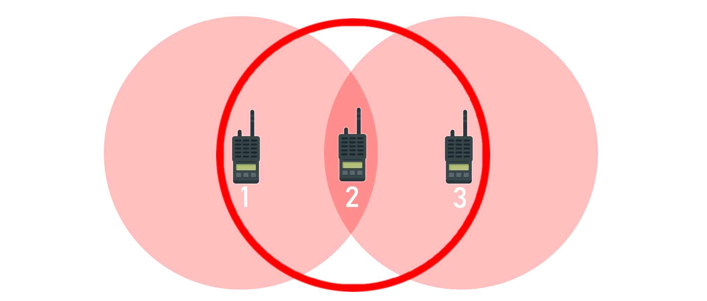
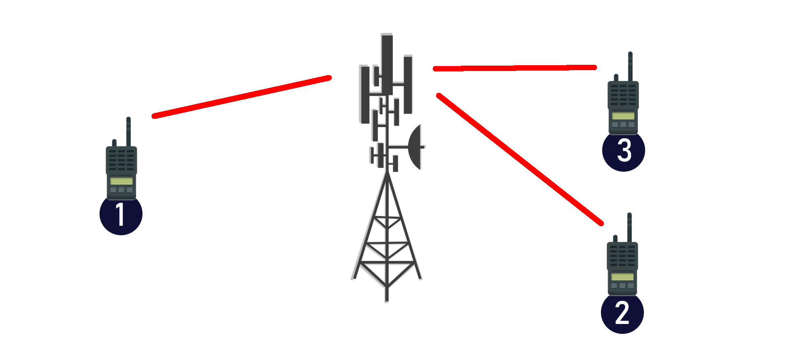

# BOS-Funk Grundlagen

Die Kommunikation zwischen Pilot und Flugverkehrskontrolle beschränkt sich auf die fliegerischen Informationen; die Koordination der Einsätze erflogt jedoch über eine weitere Instanz: Die Leitstelle.
Die ist die Koordinatorin aller Einsätze in einem definierten Gebiet und sorgt dort für die effektive Bereitstellung von Rettungsmitteln.

Deren Kommunikation läuft größtenteils über Funk ab, der sich jedoch maßgeblich vom Pilotenfunk unterscheidet - dem BOS-Funk.

**BOS** steht für "Behörden und Organistationen mit Sicherheitsaufgaben", dazu zählen Feuerwehr, Rettungsdienst (inkl. Luftrettung), Polizei, aber auch das Technische Hilfswerk THW und viele andere.
Während in Deutschland lange der analoge UKW BOS-Funk verbreitet war, befasst sich dieser Artikel vorerst mit dem nach und nach einheitlichen digitalen TETRA-BOS Funk.

Für den BOS-Funk in Deutschland verantwortlich ist die in 2007 gegründete [**Bundesanstalt für den Digitalfunk der Behörden und Organisationen mit Sicherheitsaufgaben**](https://www.bdbos.bund.de/DE/Home/home_node.html) - kurz BDBOS.
Sie gibt an, dass bereits 99,2 % der Fläche Deutschlands einsatzbereit für den Digitalfunk sind.

## Funktion

Digitalfunkgeräte der BOS in Deutschland werden mit einer sogenannten BSI-Sicherheitskarte ausgestattet. Sie ist ähnlich einer SIM-Karte und berechtigt das Funkgerät zum Zugriff auf das bereitgestellte Digitalfunknetz.
Diese Karte wird nur an berechtigte Teilnehmer ausgegeben und schützt somit vor einem (im Analogfunk verbreiteten) Abhören von Funkgesprächen.

Der Funkverkehr findet im Kontrast zu "Frequenzen" im Luftverkehr oder "Kanälen" im Analogfunk in sogenannten "Rufgruppen" statt und wird digital abhörsicher verschlüsselt.

## Betriebsarten

Im TETRA-BOS Funk gibt es zwei sogenannte Betriebsarten - sie geben im groben an, wie das Empfänger-Endgerät erreicht wird.

### DMO Betrieb

**DMO** steht für **D**irect **M**ode **O**peration, also den _Direktbetrieb_. Vereinfacht gesehen kommuniziert ein Funkgerät mit anderen Endgeräten in der Umgebung, wobei sich Sender und Empfänger in einem bestimmten Radius befinden müssen - die Verbindung wird direkt (**direct**) zwischen den Funkgeräten aufgebaut.
Dadurch ist der DMO-Betrieb anfällig für bestimmte Störfaktoren wie abschirmende Metalle, Gebäude, Berge und Täler etc.
Er ist außerdem **reichweitenbegrenzt**.
So kann es passieren, dass man Teilnehmer in der aktuellen Rufgruppe auf Funksprüche antworten hören kann, welche man aufgrund der eigenen Reichweite selbst nicht hören konnte.

Im Beispiel kann Funkgerät 2 an beide anderen Funkgeräte senden und Nachrichten von ihnen Empfangen. 1 und 3 können zwar auf beide Wege mit Funkgerät 2 kommunizieren, jedoch nicht miteinander, da die Entfernung zwischen ihnen zu groß ist.

:::tip Eselsbrücke
**DMO** ist der **D**orf**mo**dus - kurze Reichweite, aber für eine lokale Einsatzkoordination komplett ausreichend.
:::

### TMO Betrieb

**TMO** steht für **T**runked **M**ode **O**peration, den sogenannten _Netzbetrieb_.
Hier wird eine Verbindung zwischen dem Funkgerät und einer der deutschlandweit verteilten TETRA-Antennen hergestellt, welche den Funkspruch innerhalb der Rufgruppe an weitere Antennen und final an die entsprechenden Empfänger "zustellt". So ist der TMO Betrieb weitesgehend reichweitenunbegrenzt, aber immer noch Abhängig von bekannten Störfaktoren und der TETRA-Netzabdeckung.
Ein Beispiel hier ist der klassische Leistellenfunk. Vor allem in großen Funkverkehrsbereichen ist die DMO-Reichweite selbst bei optimalen Bedingungen nicht ausreichend, um alle Teilnehmer zuverlässig zu erreichen.
In einer TMO Leitstellen-Rufgruppe wird die Reichweite erhöht und alle Teilnehmer im Funkverkehrsbereich können Gespräche mithöhren und an ihnen teilnehmen.

Im Beispiel können alle drei Funkgeräte untereinander über eine erhöhte Reichweite kommunizieren. Dabei können auch mehrere TETRA-Masten zwischengeschaltet oder ein Direktruf zwischen zwei einzelnen Funkgeräten aufgebaut werden.

## Sonstiges

Mit Handfunkgeräten können auch sogenannte "Repeater" realisiert werden. Gesonderte Geräte werden taktisch platziert und wiederholen (engl. "to repeat") das Signal innerhalb einer DMO-Rufgruppe, um die Reichweite zu erhöhen oder innerhalb von Objekten eine bessere Abdeckung zu gewähleisten.

Auch ist ein sogenannter "Gateway-Betrieb" möglich. Ein Handfunkgerät kommuniziert im DMO mit einem Fahrzeugfunkgerät, welches auf eine TMO-Rufgruppe eingestellt ist und den DMO- zu einem TMO-Ruf macht.

Notrufe, die von einem Funkgerät ausgelöst wurden, haben in der Rufgruppe immer eine Sprechpriorität und unterbrechen bis zur Auflösung des Notrufs und nach einer bestimmten Zeit jeglichen anderen Funkverkehr.

## Besondere Rufgruppen

Um einen geordneten Einsatz- und Leitstellenfunk gewährleisten zu können, gibt es diverse Rufgruppen im DMO- und TMO-Betrieb. Diese sind meist spezifisch auf eine BOS ausgelegt, so gibt es etwa TMO- und DMO-Rufgruppen für den Rettungsdienst, die Feuerwehr oder die Polizei. Da die BSI-Sicherheitskarte bzw. der zuständige Administrator den Zugriff auf die jeweiligen Rufgruppen ggf. untersagt, existieren sogenannte **TBZ**-Rufgruppen. Sie dienen der **t**echnisch-**b**etrieblichen-**Z**usammenarbeit und kommen zum Einsatz, wenn bspw. ein Hubschrauber in Absprache mit der örtlichen Feuerwehr einen Landeplatz ausfindig macht, oder z.B. mit DLRG, Polizei, Feuerwehr vermisste Personen in Gewässern sucht.

Außerdem verfügen die meisten Leitstellen über gesonderte und standardisierte Fremdrufgruppen, über die Fahrzeuge aus fremden Funkverkehrsbereichen Erstkontakt mit der jeweiligen Leistelle aufnehmen kann.
