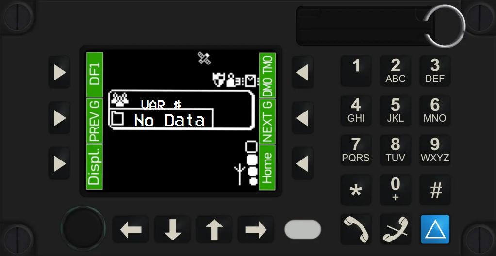
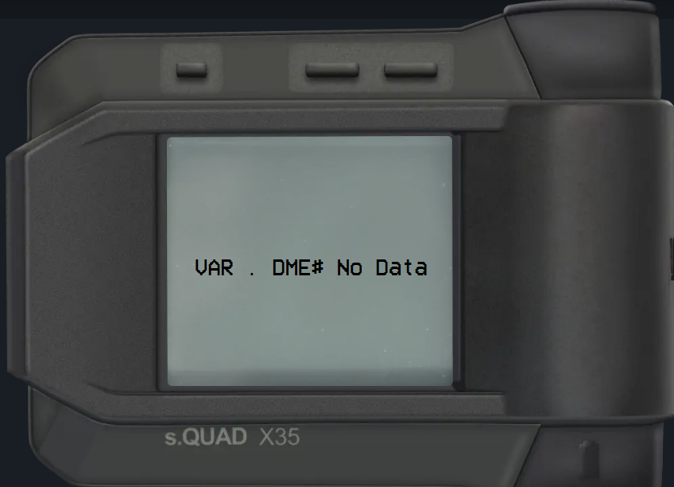

# Piloten

Auf dieser Seite beziehen wir uns auf [die /pilot Seite](https://lst.premiumag.de/pilot) des Leitstellensystems.

Während du auf VAR fliegst, muss diese Seite, neben dem Desktop Client, immer geöffnet bleiben, da hierüber die gesamte Kommunikation passiert.

## MRT

Das Mobile Radio Terminal - kurz MRT - ist die Schnittstelle zwischen Fahrzeug und der Leistelle, hierüber gibst funkst und gibst du Statusmeldungen an die Leistelle weiter und seit unserer V2 erhälst du nun auch SDS Nachrichten auf dem MRT.

Simuliert sind die Tasten 0-9 sowie der vom Display aus obere rechte knopf zum bestätigen einer SDS Nachricht.

Auf dem Display steht jeweils dein Callsign wenn du verbunden bist.

## DME

Der Digitalfunkmeldeempfänger ist ein kleines Gerät, was immer bei dem jeweiligen Crewmitglied bleibt. Hierüber bekommt das Crewmitglied seine Alarmierung mit Ton und Text. Angezeigt wird eine kurze Einsatzbeschreibung und die Einsatzsortschaft.

Simuliert sind die obere linke Taste, um auf den Hauptbildschirm zurück zu kehren nach einer Alarmierung, sowie der obere rechte runde Knopf (hier nur von der Seite zu sehen), um den Einsatz zu quittieren und den Piepton zu stoppen.

Auf dem Display stehen das jeweilige Callsign sowie der eigene Name. Im Einsatzfall steht die Alarmierung auf dem Display.
