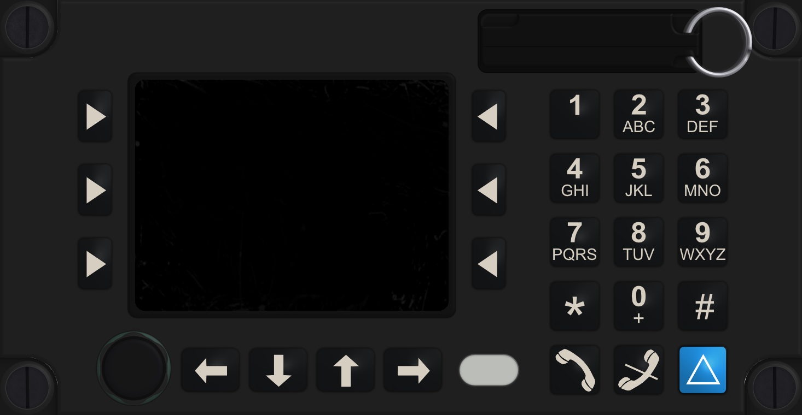
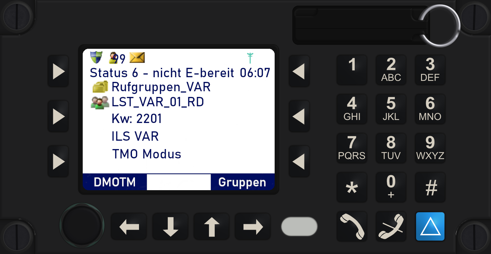
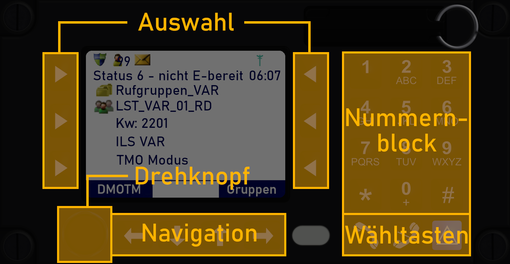
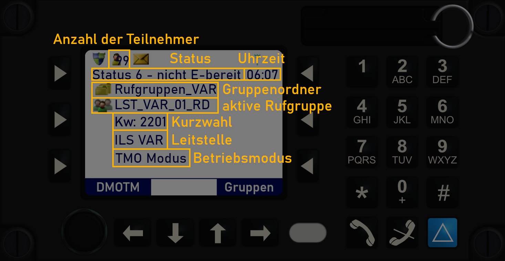
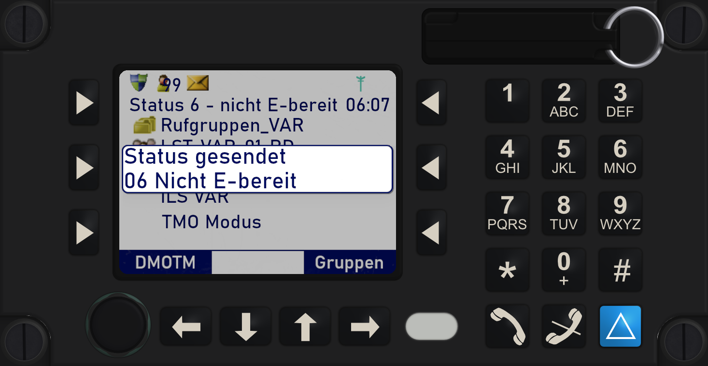
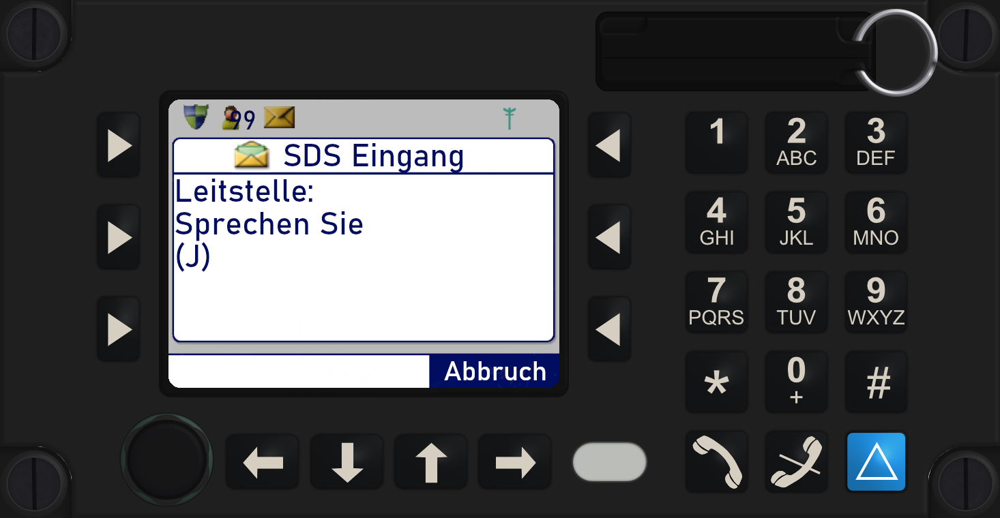
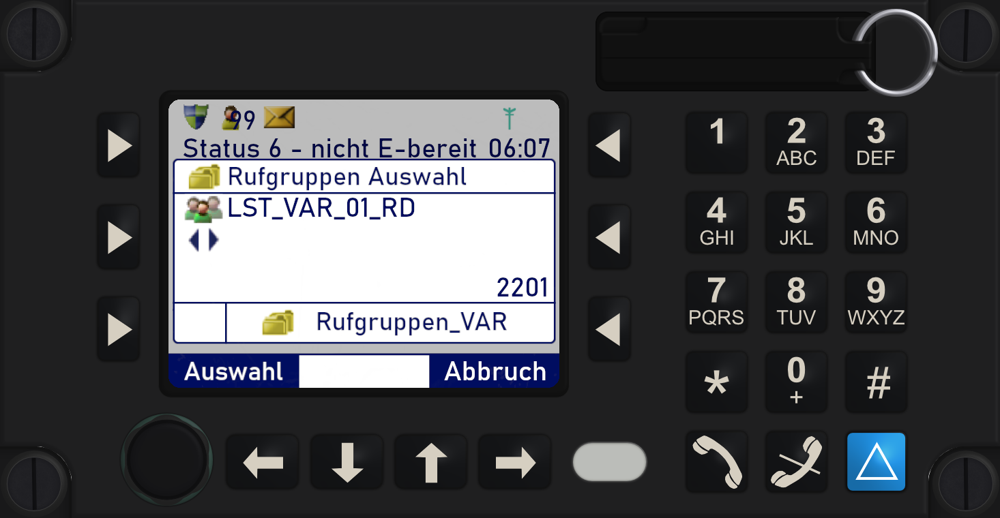
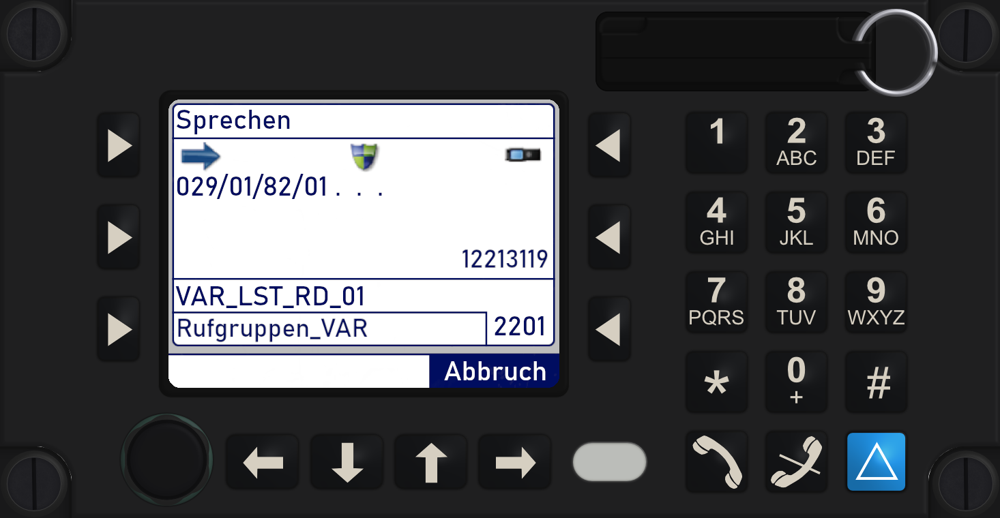
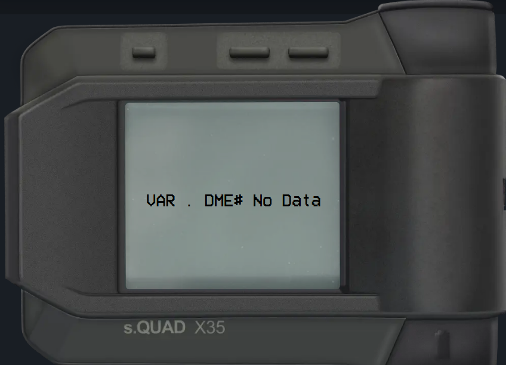

# Piloten

Auf dieser Seite beziehen wir uns auf "Pilot"-Seite des Leitstellensystems.

## MRT

Das Mobile Radio Terminal – kurz MRT – ist die Schnittstelle zwischen Fahrzeug und der Leitstelle. Hierüber funkst du, gibst Statusmeldungen an die Leitstelle weiter und erhältst SDS-Nachrichten.
Wir versuchen, die grundlegenden Funktionen des klassischen Hubschrauber-MRTs zu emulieren. In Deutschland kommt dafür zumeist die Hubschrauberbedieneinheit 767 (kurz: HBE767) der elektronik-labor CARLS GmbH & Co. KG aus Neuenkirchen zum Einsatz. In Kombination mit dem TETRA-Mobilfunkgerät Sepura SCG22 der SELECTRIC Nachrichten-Systeme GmbH aus Münster ermöglicht sie auch Luftrettungsmitteln die Teilhabe am Digitalfunk.
Während das Aussehen der HBE quasi identisch mit dem realen Vorbild nachgebildet wurde, haben wir die Funktionalität der Sepura-Oberfläche nur grundlegend und etwas freier abbilden können.
Nachfolgend findet ihr eine kurze Bedienungsanleitung.

### Einschalten des Geräts
Um das zunächst ausgeschaltete Gerät in Betrieb zu nehmen, musst du dich entweder Verbinden oder die Taste 1 gedrückt halten. Das Gerät startet und bucht sich automatisch in die Rufgruppe LST_VAR_01_RD ein.

### Übersicht
Die HBE767 verfügt über einen klassischen Nummernblock. Hier kannst du einen Status senden oder eine Kurzwahlnummer eingeben.
Die Auswahlknöpfe links und rechts vom Bildschirm werden vor allem für die Auswahl der unteren beiden Optionen genutzt. In diesem Beispiel würde der linke untere Knopf die Option „DMOTM(O)“ anwählen; der rechte untere Auswahlknopf würde die Gruppenauswahl öffnen, in welcher die Navigationsknöpfe die Gruppe bzw. den Ordner wechseln können.
Der Druck auf den Drehknopf öffnet ebenfalls die Gruppenauswahl.

Der Bildschirm zeigt dir unterschiedliche Informationen, unten findest du eine Legende:

### Status/SDS-Text senden
Um einen Status bzw. einen SDS-Text zu senden, musst du den entsprechenden Knopf im Nummernblock länger als 0,6 Sekunden gedrückt halten.
Es erscheint ein Popup mit einer entsprechenden Bestätigung.

:::info Status vs. SDS-Text
Wir unterscheiden innerhalb der HBE grundlegend zwischen klassischem Status und SDS-Text. Zu SDS-Texten gehören (priorisierte) Sprechwünsche, Fahrzeuganmeldungen und SDS-Texte auf dem Meldeweg Leitstelle – Fahrzeug.
Das Senden eines SDS-Textes ändert den Fahrzeugstatus nicht. Drückt man also Status 5, wird die Leitstelle per SDS („SDS-Text gesendet: Sprechwunsch“) über den Gesprächsaufbau informiert und der aktuelle Fahrzeugstatus ändert sich nicht.
:::

### SDS-Text empfangen
Sendet die Leitstelle dir einen SDS-Text, kannst du das Popup über den rechten unteren Auswahlknopf („Abbrechen“) schließen.

### Rufgruppe wechseln
Das Wechseln der Rufgruppe per Dropdown ist mit Einführung der HBE nicht mehr möglich und muss nun im Gerät selbst durchgeführt werden. Dazu könnt ihr folgende Anleitung befolgen:
1. Aufrufen der Gruppenauswahl über „Gruppen“ oder Klick auf den Drehknopf
2. Wahl der Rufgruppe mittels Pfeiltasten

alternativ:

2. Eintippen der Kurzwahlnummer der Rufgruppe (22 + Nummer der Rufgruppe). Danach sollte der richtige Bezeichner angezeigt werden
3. 5 Sekunden warten oder „Auswahl“ drücken

### Gruppenruf
Um einen Gruppenruf zu starten, wird die übliche Taste gedrückt und gewartet, bis der Ruf aufgebaut wurde. Der erfolgreiche Rufaufbau wird in der Kopfzeile des Gruppenruf-Fensters mit dem Wort „Sprechen“ angezeigt.

## DME

Der Digitalfunkmeldeempfänger ist ein kleines Gerät, was immer bei dem jeweiligen Crewmitglied bleibt. Hierüber bekommt das Crewmitglied seine Alarmierung mit Ton und Text. Angezeigt wird eine kurze Einsatzbeschreibung und die Einsatzsortschaft.

Simuliert sind die obere linke Taste, um auf den Hauptbildschirm zurück zu kehren nach einer Alarmierung, sowie der obere rechte runde Knopf (hier nur von der Seite zu sehen), um den Einsatz zu quittieren und den Piepton zu stoppen.

Auf dem Display stehen das jeweilige Callsign sowie der eigene Name. Im Einsatzfall steht die Alarmierung auf dem Display.
