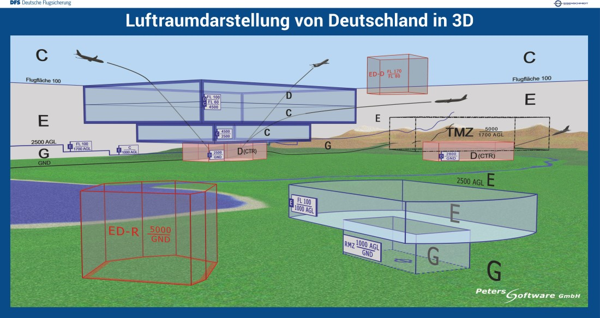
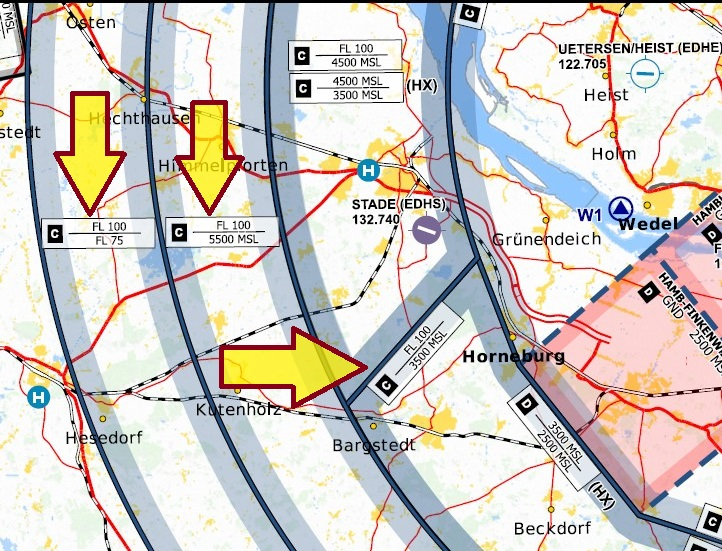
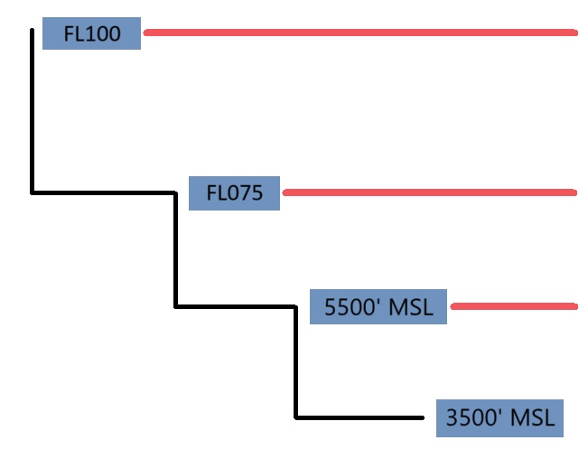
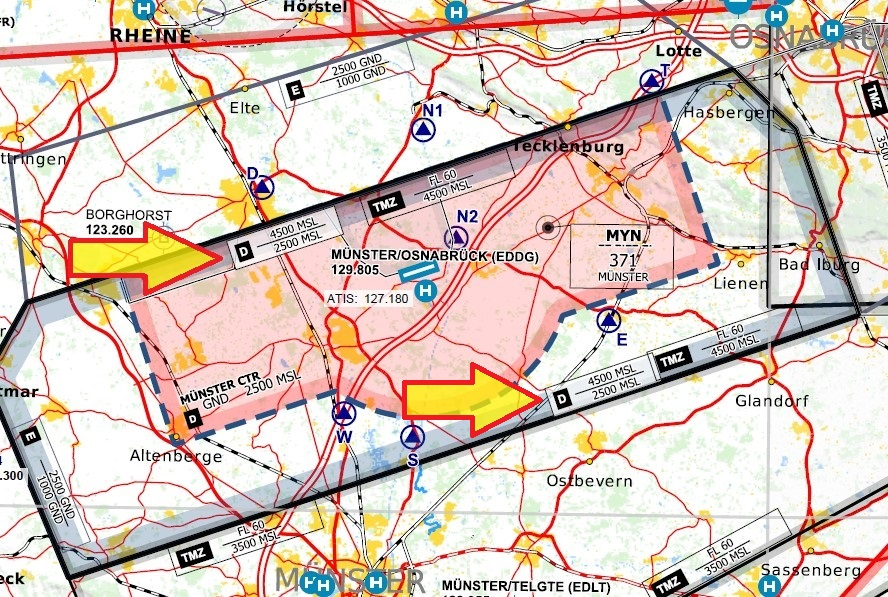
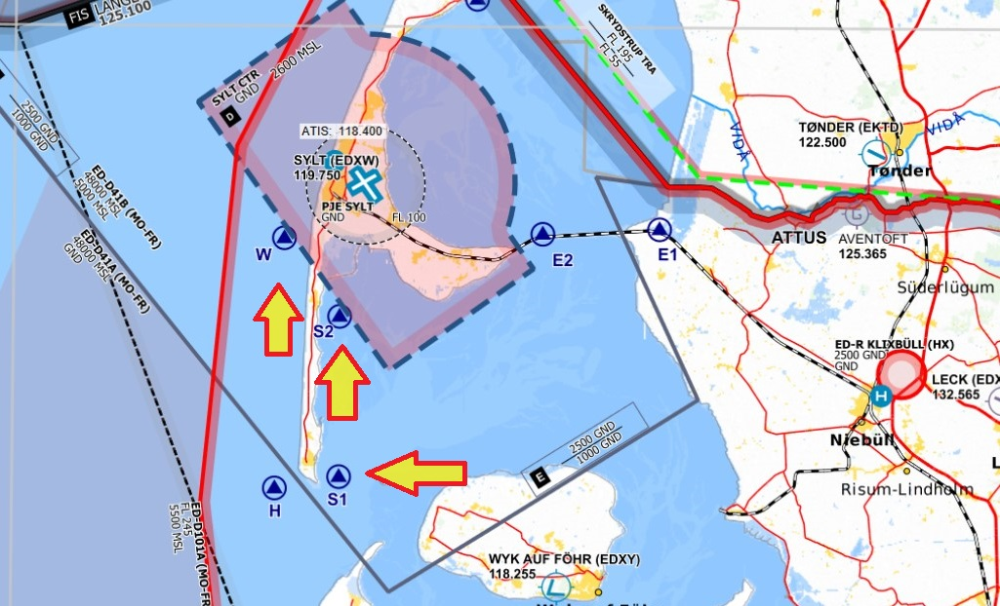
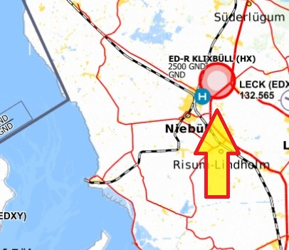
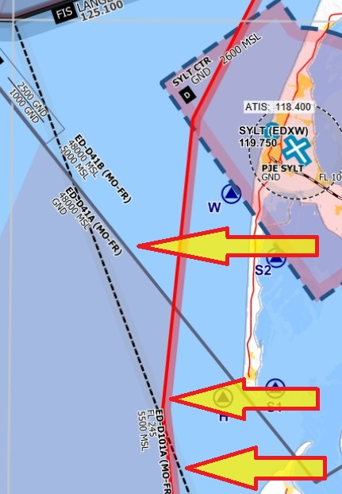

# Luftraumstruktur

Lufträume sind Gebiete, welche **dreidimensionale Ausdehnung** besitzen, sich in unserer Erdathmosphäre befinden und dem Luftverkehr eine wichtige Struktur bieten.

Diese Lufträume sind leider nicht mit bloßen Auge sichtbar. Piloten nutzen deshalb Charts und Karten, um eine Luftraumverletzung zu verhindern. (mehr zum Thema Kartenkunde wird momentan erarbeitet)  Lufträume haben nicht immer eine feste Form - manche sind eckig, manche sind rund, manche sind wie umgedrehte "mehrstöckige Hochzeitstorten"/"Maya-Pyramiden" (-> s. Lufträume im Bild unten) aufgebaut. Anhand des nachfolgenden Bildes könnt ihr einen ersten Überblick über den Aufbau der Luftraumstruktur Deutschlands in 3D gewinnen:

### Luftraumstruktur  

_Quelle: DFS_  

Vereinfacht gesagt bringt jeder Luftraum spezifische **Charaktaristika**, aber auch **Limitationen** mit sich.  

    Lufträume können zum Beispiel...
    - kontrolliert oder unkontrolliert sein
    - gestaffelt oder ungestaffelt sein
    - nur mit oder ohne Freigaben eingeflogen werden
    - mit spezifischen Wetterminima für die Durchführung von Sichtflug hinterlegt sein

Diese sind - hier in Deutschland - nach der SERA (**S**tandardized **E**uropean **R**ules of the **A**ir) fest definiert.  
Klingt kompliziert? Keine Sorge, später besprechen wir alle Punkte step-by-step. 😄

## Welche Lufträume gibt es in Deutschland?  

- Class G
- Class E
- Class D + D-CTR
- Class C
- RMZ
- TMZ

_Der Vollständigkeit halber werde ich die folgenden "Special Use" Lufträume noch erwähnen:_

- ATZ
- ED-D
- ED-R

Prinzipiell kann man sagen, dass je **früher der Buchstabe im Alphabet** vorkommt, **desto strenger** ist der Luftraum reguliert.
(Das "C" kommt vor dem "G" --> Class Charlie ist restriktiver als Class Golf)

### Übersicht der Lufträume in Deutschland

_Quelle: DFS_  

Lasst uns nun mit den einzelnen Lufträumen beginnen!

## Class Golf

Luftraum Golf ist ein Luftraum nur für Privatpiloten, die mit ihrer kleinen Cessna zum Golfen fliegen. Spaß beiseite - Luftraum Golf ist ein **unkontrollierter Luftraum** in dem sich vor allem sehr kleine Flughäfen, aber **auch Helipads an Krankenhäusern** finden lassen. **Unkontrolliert** heißt, dass _keine Freigaben notwendig_ sind, um in diese Bereiche einzufliegen.  
Grundsätzlich befindet sich Golf an den Orten in Deutschland, in denen keine anderen Lufträume wie z.B. D-CTR, ATZ oder RMZ vorhanden sind. 
Stellt euch Golf wie eine Art Tuch vor, dass auf dem Boden Deutschlands liegt. 
Die vertikale Ausdehnung von Golf beträgt vom Ground bis 2.500 Fuß AGL. Im weiteren Verlauf sprechen wir hier von **Ober-, bzw. Untergrenze**. Die Obergrenze kann zu Gunsten anderer Lufträume (Echo, TMZ, military low level flight routes, ...) abgesenkt sein. In solchen Fällen endet der Luftraum Golf auf **1.700ft AGL oder sogar 1.000ft AGL**.

Wichtig ist hier die **Unterscheidung zwischen MSL und AGL**. Allerdings muss man berücksichtigen, dass die Obergrenze in MSL des Luftraumes Golf abhängig von der Bodenlinie ist.  
So ist die Obergrenze in Fuß MSL oftmals höher als die Obergrenze in Fuß AGL.
Dies heißt vereinfacht ausgedrückt: **wenn das Terrain ansteigt, (z.B. Alpen) so steigt auch die Obergrenze von Golf, gemessen in MSL**. Die Luftraumgrenze gemessen in **Fuß AGL bleibt trotzdem bei 2.500 Fuß**. Dies sieht man im Bild oben recht gut.  

### Fakten über Luftraum Golf

- **KEINE FREIGABE** erforderlich
- **unkontrollierter** Luftraum
- **keine Staffelung** des Verkehrs --> kein ATC = keine Staffelung
- **Hörbereitschaft** nur nachts  
- **Transponderpflicht** --> wenn vorhanden, dann ja!

- **VFR Wetterminima** --> hängen von Flughöhen und Indicated Airspeed ab:
  - _unter 1.000ft AGL UND 3.000ft MSL_  
    &nbsp;&nbsp;&nbsp;- Bodensicht  
    &nbsp;&nbsp;&nbsp;- frei von Wolken  
    &nbsp;&nbsp;&nbsp; **Sichtweite:**  
    &nbsp;&nbsp;&nbsp;&nbsp;&nbsp; < 140 KIAS &nbsp;&nbsp;&nbsp;&nbsp;= 1,5 km  
    &nbsp;&nbsp;&nbsp;&nbsp;&nbsp; > 140 KIAS &nbsp;&nbsp;&nbsp;&nbsp;= 5,0 km  
    &nbsp;&nbsp;&nbsp;&nbsp;&nbsp; **HELIKOPTER** = 800 m  
  - _über 1.000ft AGL ODER 3.000ft MSL_  
    &nbsp;&nbsp;&nbsp;- **horizontale Wolkendistanz** = 1,5km  
    &nbsp;&nbsp;&nbsp;- **vertikale Wolkendistanz** &nbsp;&nbsp;&nbsp;&nbsp;&nbsp;= 1.000ft  
    &nbsp;&nbsp;&nbsp; **Sichtweite:** &nbsp;&nbsp;&nbsp;&nbsp;&nbsp;&nbsp;&nbsp;&nbsp;5,0 km  

_Spezifizierung der Sichtweiten durch Indicated Airspeed findet nur unterhalb von 1.000ft AGL/3.000ft MSL statt!_  

## Class Echo

Luftraum Echo ist ein **kontrollierter Bereich**, der sozusagen eine Art "_Übergangsbereich_" zwischen dem Class Golf und Class Charlie Airspace ist. Echo liegt also quasi wie eine weitere Decke auf dem Luftraum Golf auf.  
Kontrolliert heißt, dass die Flugverkehrskontrolle für diesen Bereich zuständig ist und überwacht. Freigaben sind aber nur für Instrumentenflug Verkehr (**IFR**) notwendig. Da die Rettungsfliegerei primär nur im Sichtflug (**VFR**) durchgeführt wird, brauchen wir als RTH keine extra Freigaben.  
Da Luftraum Golf in aller Regel bis 2.500ft AGL hoch geht, startet der Luftraum Echo quasi **ab 2.501ft AGL**.  
Allerdings gibt es, wie im Absatz für Luftraum Golf erwähnt, abgesenkte Bereiche um Kontrollzonen oder RMZs. Allerdings beginnt auch dort der **Luftraum Echo direkt über der Obergrenze von Golf**.  
Für die maximale vertikale Ausdehnung ist das Gebiet in dem man sich befindet wichtig. Grundsätzlich ist die Obergrenze von Echo auf **FL100**. Über den Alpen erhöht sich die Obergrenze allerdings auf _FL130_. Diese Unterscheidung ist gleich **für die Wetterminima wichtig**.

:::info
**FL = Flight Level**

Ab der **Transition Altitude** spricht man nicht mehr von beispielsweise **8.000 Fuß**, sondern von _FL080_.  
Die Syntax dahinter ist ganz einfach:
Man schreibt die ersten drei Ziffern einer Höhe hinter das "FL". -> **12.000 Fuß** = _FL120_.  

Die **Transition Altitude** darf von Ländern selbst festgelegt werden und befindet sich in Deutschland auf 5.000 Fuß MSL. Beim Überschreiten dieser Höhe stellt man das Altimeter auf **1013.2 hPa**. Dies dient dazu, dass alle Luftverkehrsteilnehmer mit einem einheitlichen Luftdruck ihre Höhe bestimmen und somit dann letztendlich besser voneinander separiert werden. Das ist vor allem, aber nicht nur, für den Airline Verkehr wichtig.

:::

Die vertikale Ausdehnung vom Luftraum Echo kann mit Hilfe der Grafik oben gut nachvollzogen werden.

### Fakten über Luftraum Echo

- **Freigaben NUR für IFR Verkehr** notwendig
- **kontrollierter** Luftraum
- **IFR-zu-IFR Staffelung**
- **Hörbereitschaft** für VFR nur Nachts
- **Transponderpflicht**

  - _über 3.500ft AGL oder 5.000ft MSL_ --> ja!
  - _unter 3.500ft AGL und 5.000ft MSL_ --> wenn vorhanden, dann ja!

- **VFR Wetterminima** --> hängen von der Flughöhe ab!
- **Sichtweiten**
  - _unter FL100_ = 5km
  - _über FL100_ &nbsp;= 8km
- **Wolkendistanz**
  - _horizontal_ &nbsp;&nbsp;= 1,5km
  - _vertikal_ &nbsp;&nbsp;&nbsp;&nbsp;&nbsp;&nbsp;= 1.000ft

## Luftraum Charlie

Luftraum Charlie ist ein **kontrollierter Luftraum**, in dem sich hauptsächlich der Airline Traffic befindet.  
**VFR und IFR Verkehr benötigt eine Freigabe**, um in diesen Luftraum einzufliegen.
Charlie liegt direkt auf dem Luftraum Echo auf und **startet somit ab FL100**, _bzw. ab FL130 über den Alpen._ Die Obergrenze beträgt **FL660**.  

Charlie kann aber auch **abgesenkt** sein. Dies ist **um größere Verkehrsflughäfen** wie z.B. Berlin, Hannover oder Hamburg der Fall.  
Der Grund hierfür ist, dass die **Verkehrsstaffelung im Luftraum Charlie**. Hier wird **IFR Verkehr zu anderem IFR Verkehr, aber auch zu VFR Verkehr** gestaffelt. Der Pilot bekommt **Vektoren von ATC, um den Verkehr zu umfliegen.** Dies ist sicherheitstechnisch gesehen ein großer Vorteil, da der Pilot so mehr Kapazitäten für die arbeitsintensive Approachphase hat.  
VFR Verkehr bekommt hingegen nur Verkehrsmeldungen zu anderen VFR Luftfahrzeugen (_"D-HEMS, Verkehr auf 3 Uhr, Cessna 152, Höhe 4.000 Fuß, Flugrichtung Norden."_).

Diese Absenkung geschieht **stufenweise**. Hier wird dann recht schnell deutlich was ich vorhin mit _umgedrehter, "mehrstöckiger Hochzeitstorte"_ meinte.  
Schauen wir uns hierfür einen Abschnitt des Class Charlie um Hamburg (**EDDH**) an.

_Quelle: openflightmap.org_

Die markierten Rechtecke beinhalten Informationen zu der vertikalen Ausdehnung des Luftraumes.  
So beträgt zum Beispiel die Ausdehnung des ganz linken Bereiches FL100 - FL075. 
Die Ausdehnung im mittleren Bereich beträgt FL100 - 5.500 MSL. 
Die Ausdehnung des verbleibenden markierten Bereiches beträgt FL100 - 3.500 MSL. 
Dementsprechend sieht im Profil der Luftraum etwa so aus:  

### Fakten über Charlie

- **Freigaben für IFR und VFR** notwendig
- **kontrollierter** Luftraum
- **IFR-zu-IFR/VFR Staffelung**; _Verkehrsmeldung VFR-zu-VFR_
- **ständige Hörbereitschaft** für alle Luftfahrzeuge
- **Transponderpflicht** --> Ja!

- **VFR Wetterminima** --> hängen von der Flughöhe ab!
- **Sichtweiten**
  - _unter FL100_ = 5km
  - _über FL100_ &nbsp;= 8km
- **Wolkendistanz**
  - _horizontal_ &nbsp;&nbsp;= 1,5km
  - _vertikal_ &nbsp;&nbsp;&nbsp;&nbsp;&nbsp;&nbsp;= 1.000ft

## Luftraum Delta

Luftraum Delta ist ein **kontrollierter** Luftraum der eine ähnliche Funktion wie der **abgesenkte Charlie Luftraum** hat.
Er befindet sich im Approachbereich kleinerer Flughäfen (z.B. Münster EDDG), weshalb eine **Freigabe** zum Einfliegen benötigt wird.  
Delta **beginnt über der Delta-CTR** (_Delta Kontrollzone_) und die **Obergrenze ist der Luftraum Charlie oder Luftraum Echo** (je nach Luftraumstruktur um den Airport). Im Beispiel des Flughafen Münster (EDDG) endet der Delta Airspace zum Beispiel im Airspace Echo, wie auf dem Kartenausschnitt zu erkennen ist.  

_Quelle: openflightmap.org_

Der Delta ist hier von 2.500 MSL bis 4.500 MSL. Die Höhenangaben an den Pfeilen beziehen sich nicht auf den rot hinterlegten Bereich, sondern auf den Bereich umzogen mit der dicken, schwarzen Linie.

### Fakten über Delta

- **Freigaben für IFR und VFR** notwendig
- **kontrollierter** Luftraum
- **IFR-zu-IFR Staffelung; Achtung: zu VFR Vekehr nur Verkehrsinformation und keine Anweisungen von ATC**; _Verkehrsmeldung VFR-zu-VFR_
- **ständige Hörbereitschaft** für alle Luftfahrzeuge
- **Transponderpflicht** --> Ja!

- **VFR Wetterminima** --> hängen von der Flughöhe ab!
- **Sichtweiten**
  - _unter FL100_ = 5km
  - _über FL100_ &nbsp;= 8km
- **Wolkendistanz**
  - _horizontal_ &nbsp;&nbsp;= 1,5km
  - _vertikal_ &nbsp;&nbsp;&nbsp;&nbsp;&nbsp;&nbsp;= 1.000ft

## Luftraum Delta-Kontollzone (**D-CTR**)

Die Delta-Kontrollzone ist ein **kontrollierter** Bereich, welcher sich im näheren Umkreis um _Flugplätze mit einem erhöhten IFR Aufkommen_ befindet. Eine **Freigabe** zum Einfliegen ist für IFR und VFR Verkehr notwendig.  
Delta-CTR ist fest definiert: D-CTR startet vom Grund und die Obergrenze kann ein Charlie, Delta oder eine TMZ im Echo Luftraum sein. 
Der Einflug in die Delta-Kontrollzone erfolgt über festgelegte **Pflichtmeldepunkte**, welche auf den VFR-Karten vermerkt sind.
Allerdings ist ATC befugt _in Ausnahmefällen_ (z.B. active rescue-misson) Sondergenehmigungen für Directs zu vergeben.
Bitte bedenkt dabei immer, dass der/die Air Traffic ControllerIn auch nur im Rahmen Ihrer Befugnisse handeln. Sollte ein Direct aufgrund erhöhten Verkehrsaufkommen nicht möglich sein, so müsst ihr über die Meldepunkte an euer Ziel fliegen.  
Eine weitere Besonderheit der D-CTR ist die Wolkenuntergrenze. Sollte diese unter 1.500ft AGL liegen, so dürft ihr nicht mehr als VFR in diesem Luftraum abheben oder landen. Umgehen kann man dies mit einer SVFR Freigabe. 

:::info
**SVFR** = _Sonder-VFR/Special-VFR_  

SVFR ist der Sichtflug in einer Kontrollzone bei vorherrschenden Wetterbedingungen, welche geringer als die geforderten Minima sind. Der Zweck für SVFR ist es, bei schlechten Wetter am kontrollierten Flughafen zu starten, wenn außerhalb der Kontrollzone besseres Wetter herrscht.  
Für SVFR gibt es niedrigere Minima:  

- 600ft AGL Wolkenuntergrenze
- 1.500 Meter Sichtweite; Für Helikopter 800 Meter  
  Des weiteren gibt es eine Geschwindigkeitsbegrenzung von 140kt IAS. 
  Dieses Verfahren kann durch ATC requested werden.
  :::

### Fakten über Delta-CTR

- **Freigaben für IFR und VFR** notwendig
- **kontrollierter** Luftraum
- **IFR-zu-IFR (zusätzlich SVFR) Staffelung; Achtung: zu VFR Vekehr nur Verkehrsinformation und keine Anweisungen von ATC**; _Verkehrsmeldung VFR-zu-VFR_
- **ständige Hörbereitschaft** für alle Luftfahrzeuge
- **Transponderpflicht** --> Ja!

- **VFR Wetterminima** --> hängen von der Flughöhe ab!
- **Sichtweiten** = 5km
- **Wolkendistanz**
  - _horizontal_ &nbsp;&nbsp;= 1,5km
  - _vertikal_ &nbsp;&nbsp;&nbsp;&nbsp;&nbsp;&nbsp;= 1.000ft
  - WOLKENUNTERGRENZE: 1.500ft AGL  
    **_SVFR MÖGLICH - Wetterminima, s. oben_**

:::caution
**HX Lufträume**  
Einzelne Charlie oder Delta(-CTR) sind nur _zu bestimmten Zeiten aktiv_.  
Diese sind auf der Karte mit einem "**HX**" gekennzeichnet. Die Betriebsstunden können auf der jeweiligen _Info- oder Towerfrequenz_ erfragt werden. Ebenso können _ATIS und FIS_ eine Auskunft über den Status geben. Grundsätzlich gilt: **Wenn unsicher - als aktiv einschätzen.**  
Sollte der Luftraum inaktiv sein, so gilt er als Airspace Echo mit all seinen Eigenschaften und Minima.
:::

Die Pfeile zeigen auf die Pflichtmeldepunkte.
_Quelle: openflightmap.org_

## RMZ

Eine **RMZ** (= **R**adio **M**andatory **Z**one) ist ein **unkontrollierter** Bereich. **Freigaben** werden deshalb nicht benötigt. Allerdings muss die RMZ mit vor dem Einflug **Funkkommunikation mit der Bodenstelle** etabliert werden. 2014 wurde der **Luftraum Foxtrott** durch RMZ ersetzt.  
RMZ haben den Zweck gelegentlichen IFR Verkehr, an unkontrollierten Plätzen ohne Kontrollzone, an- und abfliegen zu lassen.  
Die Dimensionen belaufen sich vom **Boden bis auf 1.000ft AGL**. Ab der Obergrenze folgt dementsprechend Luftraum Echo.  
Der Sprechfunk muss auch weitergeführt werden, wenn keine Antwort der Bodenstelle erfolgt (z.B. der Ausflug).

### Fakten über die RMZ

- **Freigaben** nicht notwendig
- **unkontrollierter** Luftraum
- Sprechkontakt muss **vor dem Einflug** hergestellt sein --> _Callsign, Muster, Standort, Höhe, Absichten_  
  ("CHX Niedersachsen, H-145, 2 Minuten südlich der RMZ, 1.000 Fuß, Einflug in RMZ zwecks Landung am Klinikum Wilhelmshaven")
- der **Ausflug muss mit Standort gemeldet** werden
- **ständige Hörbereitschaft** für alle Luftfahrzeuge
- **Transponderpflicht** --> Nein

**VFR Wetterminima wie in GOLF**

- **VFR Wetterminima** --> hängen von Flughöhen und Indicated Airspeed ab:
  - _unter 1.000ft AGL UND 3.000ft MSL_  
    &nbsp;&nbsp;&nbsp;- Bodensicht  
    &nbsp;&nbsp;&nbsp;- frei von Wolken  
    &nbsp;&nbsp;&nbsp; **Sichtweite:**  
    &nbsp;&nbsp;&nbsp;&nbsp;&nbsp; < 140 KIAS &nbsp;&nbsp;&nbsp;&nbsp;= 1,5 km  
    &nbsp;&nbsp;&nbsp;&nbsp;&nbsp; > 140 KIAS &nbsp;&nbsp;&nbsp;&nbsp;= 5,0 km  
    &nbsp;&nbsp;&nbsp;&nbsp;&nbsp; **HELIKOPTER** = 800 m  
  - _über 1.000ft AGL ODER 3.000ft MSL_  
    &nbsp;&nbsp;&nbsp;- **horizontale Wolkendistanz** = 1,5km  
    &nbsp;&nbsp;&nbsp;- **vertikale Wolkendistanz** &nbsp;&nbsp;&nbsp;&nbsp;&nbsp;= 1.000ft  
    &nbsp;&nbsp;&nbsp; **Sichtweite:** &nbsp;&nbsp;&nbsp;&nbsp;&nbsp;&nbsp;&nbsp;&nbsp;5,0 km  

## TMZ

Die TMZ (**T**ransponder **M**andatory **Z**one) kann ein **Teil des Luftraums Echo** einnehmen, liegt aber über dem Delta Luftraum. Die TMZ ist ein **kontrollierter** Bereich. Da die TMZ ein Teil von Echo ist, wird hier **keine Freigabe für VFR** benötigt wird. Der Zweck hinter dieser Zone ist es den an- und abfliegenden Verkehr an Regionalflughäfen zu unterstützen.  
Hier muss ein auf der VFR Karte angegebener **Transpondercode eingestellt** werden und die dort ebenfalls gelistete **Monitor-Frequenz überwacht** werden. Eventuelle Verkehrsmeldungen werden hierüber gegeben, weshalb eine _dauerhafte Hörbereitschaft_ auf jener Frequenz gehalten werden muss. Nach Verlassen des Bereiches wird wieder der übliche Transpondercode geschaltet.

### Fakten über die TMZ

- **Freigaben** nicht notwendig für VFR
- **kontrollierter** Luftraum
- **ständige Hörbereitschaft** für alle Luftfahrzeuge auf ausgewiesener Monitor-Frequenz
- **Transponderpflicht** --> Ja! Ausgewiesenen Transpondercode schalten!

**VFR Wetterminima wie bei ECHO**

- **VFR Wetterminima** --> hängen von der Flughöhe ab!
- **Sichtweiten**
  - _unter FL100_ = 5km
  - _über FL100_ &nbsp;= 8km
- **Wolkendistanz**
  - _horizontal_ &nbsp;&nbsp;= 1,5km
  - _vertikal_ &nbsp;&nbsp;&nbsp;&nbsp;&nbsp;&nbsp;= 1.000ft

**Kommen wir nun zu den speziellen Lufträumen:**

## ATZ

Die ATZ (**A**erodrome **T**raffic **Z**one) ist ein Bereich um einen **unkontrollierten** Flugplatz, um den umgebenden Flugverkehr zu schützen. Mittlerweile sind ATZ in Deutschland eher eine _Rarität_ geworden.  
Das Einfliegen in den Luftraum ist **nur für Starts und Landungen** erlaubt. Ein reiner **Durchflug ist nicht zulässig**. Eine Anmeldung hat **10 Minuten** vor dem Einfliegen in die ATZ nötig. **Starts und Landungen** bedürfen der vorherigen Genehmigung der Flugverkehrskontrolle, bzw. des Flugleiters.  
Es herrschen die Luftraum Golf Minima.

## ED-R

Die **ED-R** (_Restricted Area_) sind Bereiche in denen der **Durchflug verboten oder aber besonderen Beschränkungen** unterworfen ist. Restricted Areas befinden sich unter anderem in _militärischen Übungsgebieten oder um schutzbedürftige Objekte_ (z.B. 3nm Restricted Area um den Bundestag).
Manche ED-R haben **Aktivierungszeiten**. Diese können bei ATC/FIS erfragt werden.  
Auch hier gilt: _wenn unsicher - Zone als aktiv betrachten._  
Für Polizei, Militär, sowie Luftrettungsdienst gelten Ausnahmeregelungen zum durchqueren von ED-R.
Die Dimensionen des Gebiets (horizontal und vertikal) sind aus den Karten zu entnehmen.

_Quelle: openflightmap.org_

## ED-D

Die **ED-D** (_Danger Area_) sind Bereiche über _internationalen Gebieten_, welche allerdings im **Zuständigkeitsbereich der Deutschen Flugsicherung** stehen. Hier sind oftmals **militärische Gefahren** für den Luftverkehr präsent. (Schiessübungen, o.ä.)
Prinzipiell ist der **Durchflug erlaubt**, _aber nicht empfohlen_. Es ist ratsam einen Durchflug vorher FIS mitzuteilen.
Die Dimensionen des Gebiets (horizontal und vertikal) sind aus den Karten zu entnehmen.

_Quelle: openflightmap.org_

**Bei Fragen, Unklarheiten oder Verbesserungen stehe ich gerne zur Verfügung. VAR0084**
