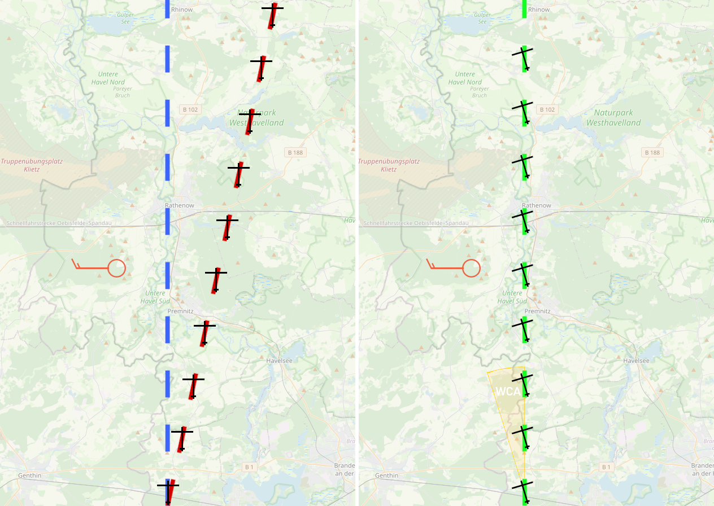

# Meteoroglogie

Essentiell für die Entscheidung darüber, ob geflogen werden kann oder nicht und wenn ja wo oder unter welchen Umständen, ist das Flugwetter. In diesem Artikel über die Meteorologie gehen wir auf die beinflussenden Faktoren ein, wie sich diese auf den Flug Auswirken und welche Grenzen uns für einen Flug gesetzt sind.

## Wind

Maßgebllich für unsere wahre Geschwindigkeit ist der auf unser Luftfahrzeug wirkende Wind. Gegenwind verlangsamt uns teilweise erheblich, Rückenwind bringt uns schneller ans Ziel und Seitenwind bringt uns (ohne die richtige Korrektur) von unserem Kurs ab.

Die Windrichtung in der Luftfahrt ist immer die Richtung, aus der der Wind kommt, nicht die Richtung, in die er weht.
"Wind 230 Grad" heißt also, dass der Wind bei einem Steuerkurs von 230 direkt von vorne auf das Luftfahrzeug einwirkt.

### Windpfeile

Windpfeile zeigen auf symbolische Art die Richtung und Stärke des Windes. Die Richtung aus welcher der Pfeil erscheint ist jene, aus welcher der Wind wirkt. Die Pfeilfedern zeigen die Windstärke an und können kombiniert werden. In den meisten digitalen Anzeigen in Luftfahrzeugen wird "kein Wind" oder ein nicht klar messbarer Wind mit zwei inneinander liegenden Kreisen dargestellt.

| Windgeschwindigkeit |             Darstellung             |
| ------------------- | :---------------------------------: |
| Kein Wind           |  |
| 5 Knoten            |     |
| 10 Knoten           |    |
| 15 Knoten           |    |
| 50 Knoten           |    |

Eine kleine Feder zeigt 5 Knoten, eine große 10 Knoten und eine Dreiecksfeder 50 Knoten. Diese können wie gewünscht kombiniert und addiert werden. So sind 35 Knoten wind 3 große und eine kleine Feder.

### Windsack

Etwas analoger funktioniert der Windsack (oder "Windrichtungsanzeiger"). Er kombiniert, wie auch ein digitaler Windpfeil, zwei Informationen in einer Darstellungsform.
So kann er zum einen (wie der Name verrät) die Windrichtung, zum anderen eine grobe Windgeschwindigkeit anzeigen.
Die Spitze des Windsacks zeigt logischerweise in die Richtung, in die der Wind weht und nicht, woher er kommt.

Als Faustformel steht jeder aufgeblasene Ring des Windsacks nämlich für etwa 3 bis 5 Knoten Wind.

Ein großer Vorteil an Windsäcken ist, dass sie an allen Flug- und Hubschrauberlandeplätzen Vorschrift sind und schnell und intuitiv abgelesen werden können.

### sonstige Windanzeiger

Neben den oben genannten Möglichkeiten gibt es viele weiter (teils noch einfachere) Tricks, den Wind aus der Luft "abzulesen". Das wird besonders hilfreich, wenn an einer Außenlandestelle keine genaue Windinformationen verfügbar ist. Hier sind einige aufgelistet

- Bäume oder Pflanzen auf Feldern biegen sich immer entgegen der Windrichtung
- Windräder (sofern aktiv) drehen sich immer automatisch in den Wind. Die Rotornabe zeigt also genau in die Richtung, aus der der Wind kommt.
- Wellen auf Seen, Flüssen oder Meeren breiten sich immer mit dem Wind aus
- Alle Flaggen funktionieren im Prinzip wie Windsäcke
- Aufgewirbelter Staub (bspw.: von Erntemaschinen) wird vom Wind mitgetragen
- Aufsteigender Dampf oder Rauch aus Schornsteinen

Nicht zuletzt gibt auch ein **METAR** Aufschluss über die Windrichtung an einem Flugplatz. Mehr dazu weiter unten.

### WCA (Wind Correction Angle)

Wie bereits erwähnt sorgt nicht parallel zur Flugrichtung am Luftfahrzeug anliegender Wind zu einer verschiebung des Flugwegs.

Bei selbem Steuerkurs kommt das Luftfahrzeug vom "Kartenkurs" (also dem Kurs zu einem definierten Ziel) ab.

Um dem entgegenzuwirken wird der Steuerkurs in Richtung der Windrichtung geändert, um der Verschiebung des Flugweges entgegenzuwirken. Der entstehende Winkel ist der **Wind Correction Angle**.

Zur Berechnung des WCA benötigen wir zuerst unsere Seitenwindkomponente _s_; also den Anteil des Seitenwindes, der direkt senkrecht zu unserer Flugrichtung wirkt.

Diese errechnet sich aus

`s = W * sin(Winkel)`

Den WCA berechnen wir dann einfach mit der erhaltenen Seitenwindkomponente _s_ und der wahren Eigengeschwindigkeit _TAS_ durch

Nach Berechnen des WCA ist der Kurs um diesen Winkel einfach nur vom Steuerkurs abzuziehen (bei Wind von der linken Seite) bzw. zu ihm hinzuzurechnen (bei Wind von der rechten Seite).

Bei fehlendem WCA kommt das Luftfahrzeug vom geplanten Kurs ab.
Mit WCA bleibt das Luftfahrzeug auf dem geplanten Kurs.

  
Hier ein kleines Beispiel

  

    Du fliegt mit deiner H145 vom Einsatzort an einem Windstillen Tag auf
    <b>Kurs 280</b> zur Zielklinik. Auf einmal kommt ein Seitenwind aus der
    <b>Windrichtung 170</b> und einer Geschwindigkeit von <b>30 Knoten</b> auf
    dein <b>TAS beträgt 120 Knoten</b>.

    <b>Welchen Steuerkurs fliegst du zur Zielklinik?</b>
    

      
Lösung

      

        HDG 266 (<i>s</i>=28,19 Knoten)
      

    

  

## Sichtweite

Bei der Sichtweite unterscheiden wir zwischen Boden- und Flugsicht. Die Bodensicht ist die Sichtweite horizontal am Boden von einem Beobachter in die Ferne. Zur Ermittlung der Sichtweite an Flugplätzen werden gewöhnlich Hilfsziele in der Ferne genutzt von welchen man die Entfernung kennt _(Kirchentürme, markante Gebäude oder Baumgruppen, etc)_. Die Flugsicht gibt an, wie weit man aus dem Cockpit eines Luftfahrzeuges horizontal sehen kann.
Außerdem gibt es auch die Erdsicht. Sie wird nicht in Metern angegeben sondern legt fest, ob der Pilot den Boden sehen kann. Das wird vor allem bei VFR-Flügen wichtig, da eine ständige Erdsicht gewährleistet werden muss.

## Bewölkung

Bei der Bewölkung bzw. Wolken generell handelt es sich start vereinfach um sichtbar gewordene Wassertropfen. Wasser besitzt drei verschiedene Aggregatzustände, fest, flüssig und gasförmig. Feuchte warme Luft steigt gasförmig in einer Warmluftblase auf, kühlt mit der Zunahme von Höhe immer weiter ab, bis es wieder kondesiert - also in die flüssige Phase übergeht. So entsteht eine klassische Cumuluswolke.

### Wolkentypen und -gattungen

_\*Anklicken für mehr Details\*_

 
Tiefe Wolken

Alle Wolken, die bis 2 km über dem Erdboden auftreten.

::: details <b>Stratocumulus</b> - Haufenschichtwolken
Bewirken kühlenden Effekt auf die Erdoberfläche.

[<b>Foto einer Stratocumuluswolke</b>](https://upload.wikimedia.org/wikipedia/commons/thumb/5/5d/Stratocumulus_stratiformis_perlucidus_translucidus.jpg/1024px-Stratocumulus_stratiformis_perlucidus_translucidus.jpg)
:::

::: details <b>Stratus</b> - Hochnebel
Strukturlose Schichtwolken. Generieren häufig feinen Sprühregen.

[<b>Foto einer Stratuswolke</b>](https://upload.wikimedia.org/wikipedia/commons/thumb/2/21/High_Stratus_nebulosus.jpg/1024px-High_Stratus_nebulosus.jpg)
:::

 
Mittelhohe Wolken

Alle Wolken, die zwischen 2 und 7 km über dem Erdboden auftreten.

::: details <b>Altocumulus</b> - große Schäfchenwolken
Treten in ausgedehnten Feldern (bestehend aus einzelnen Wölkchen) auf. Verstärken UV-Strahlung.

[<b>Foto einer Altocumuluswolke</b>](https://upload.wikimedia.org/wikipedia/commons/thumb/1/14/Garten_5.jpg/1024px-Garten_5.jpg)
:::

::: details <b>Altostratus</b> - mittelhohe Schichtwolken
Graue Schichtwolke ohne Konturen.Niederschlag meist Regen, Schnee oder Einskörner nach maximal 9 h.

[<b>Foto einer Altostratuswolke</b>](https://upload.wikimedia.org/wikipedia/commons/thumb/a/a3/As_1.jpg/1024px-As_1.jpg)
:::

 
Hohe Wolken

Alle Wolken, die zwischen 5 und 13 km über dem Erdboden auftreten.

::: details <b>Cirrus</b> - Federwolken
Hohe Eiswolke; leuchtende, zarte Fäden. Kondensstreifen.

[<b>Foto von Cirruswolken</b>](https://upload.wikimedia.org/wikipedia/commons/3/36/Cirrus_sky_panorama.jpg)
:::

::: details <b>Cirrocumulus</b> - kleine Schäfchenwolken
Dünne, weiße Flecken oder Felder.

[<b>Foto von Cirrocumuluswolken</b>](https://upload.wikimedia.org/wikipedia/commons/thumb/1/16/Cirrocumulus_undulatus_in_various_directions.JPG/1024px-Cirrocumulus_undulatus_in_various_directions.JPG)
:::

::: details <b>Cirrostratus</b> - hohe Schleierwolken
Feine Schleuer aus Eiskristallen. Bilden sich, wenn große Warmluftmassen aufsteigen und Feuchtigkeit kondensiert. Vorboten einer Warmfront.

[<b>Foto einer Cirrostratuswolke</b>](https://upload.wikimedia.org/wikipedia/commons/thumb/c/cc/Cs1.jpg/1024px-Cs1.jpg)
:::

 
Vertikale Wolken

Wolken, die sich "höhenübergreifend" bilden.

::: details <b>Nimbostratus</b> - typische Regenwolke
Konturlose, blaugraue Wolke. Verursacht langanhaltende Niederschläge.

[<b>Foto von Nimbostratuswolken</b>](https://upload.wikimedia.org/wikipedia/commons/thumb/4/4f/Ns1.jpg/1024px-Ns1.jpg)
:::

::: details <b>Cumulus</b> - Quellwolken
Flache Unterseite mit Blumenkohlköpfen. Zeigen Thermimken an.

[<b>Foto einer Cumuluswolke</b>](https://upload.wikimedia.org/wikipedia/commons/thumb/2/2b/Cumulus_cloud_above_Lechtaler_Alps_at_tannheim%2C_Austria.jpg/1024px-Cumulus_cloud_above_Lechtaler_Alps_at_tannheim%2C_Austria.jpg)
:::

::: details <b>Cumulonimbus</b> - Gewitterwolken
In ausgewachsenen Stadien verantwortlich für massive Schauer und Hagel. Vertialgeschwindikeiten von bis zu 120 km/h. <b>In der Luftfahrt darum immer zu umfliegen!</b>

[<b>Foto einer Cumulonimbuswolke</b>](https://upload.wikimedia.org/wikipedia/commons/thumb/8/8a/Kumulonimbuswolke_%C3%BCber_Jena.JPG/1024px-Kumulonimbuswolke_%C3%BCber_Jena.JPG)
:::

## Bedeckungsgrad

In de Luftfahrt wird als grober Anhaltspunkt für die "Durchsichtigkeit" einer Wolkendecke der Bedeckungsgrad angegeben.
Er gibt Aufschluss darüber, wie bedeckt der Himmel ist, ob man durch Wolkenschichten hindurchsehen oder durch die hindurchfliegen kann, ohne die Bodensicht aufzugeben.

Die Klassifizierung erfolgt folgendermaßen:

| Bedeckung   | Name                       | Abkürzung |
| ----------- | -------------------------- | --------- |
| 0           | keine nennenswerten Wolken | NSC       |
| 1/8 bis 2/8 | gering bewölkt             | FEW       |
| 3/8 bis 4/8 | aufgelockert bewölkt       | SCT       |
| 5/8 bis 7/8 | durchbrochen bewölkt       | BKN       |
| 8/8         | bedeckt                    | OVC       |

## Temperatur

Die Temperatur wird in Deutschland in Grad Celsius (°C) angegeben. Diese Maßeinheit wurde historisch über den Schmelz-(0 °C) und Siedepunkt(100 °C) festgelegt, ist aber heute über die absolute Temperatur wie folgt definiert:

`t_{\text{°C}} = T_K - 273.15`

Die Temperatur ist ausschlaggebend für die Flugleistung und die Leistung des Triebwerks. Umso wärmer die Luft, umso geringer wird die Luftdichte. Man sagt auch, dass die "Lufteilchen weiter auseinander sind". Somit braucht unser Luftfahrzeug mehr Leistung, um vom Boden abzuheben.
Im Winter und bei kalten Verhältnissen ist die Leistung also umso besser. Die Luft ist dichter, somit muss der Hauptrotor weniger Luft bewegen, um abzuheben.

## Druck

Auf dem Boden in Meereshöhe lastet der Druck des gesamten Luftmasse von 1013,25 hPA auf uns. Mit zunehmender Höhe nimmt der Druck der darüber lastenden Luftmasse ab. D.h. der Luftdruck sinkt mit steigender Höhe, die Luft wird "dünner". Jedoch nicht linear. Nach jeweils 5500 m halbiert sich der Luftdruck. In 5500 m Höhe sind dann noch halb so viele Luftmoleküle zu finden, wie auf MSL. Die Zusammensetzung der Luft von 78% Stickstoff, 21% Sauerstoff und 1% Edelgas, Wasserdampf und Staub bleibt innerhalb der Troposphäre immer gleich.
Der Luftdruck ändert sich je nach Wetterlage. Das aktuelle QNH ist dann der METAR zu entnehmen, oder zu erfragen.

## Wettererscheinungen und Niederschläge

Bei Niederschlägen aller Art ist besondere Vorsicht geboten.
Ist eine Cumulunimbus mit hörbarem Donner um Umkreis von ca. 15 km bleibt die Maschine aus, und man zieht sie in den Hangar. Sollte ein Blitz mit mehreren 100.000 Volt unser Luftfahrzeug treffen kann sämtliche Avionik ausfallen und der Hubschrauber unkontrollierbar werden. Blitze lösen heftige Druckwellen aus, sodass extreme Böen entstehen können.
Ebenso ist in Schauerartigen Niederschlägen extreme Vorsicht geboten! Es kann zum kompletten Verlust von Erd und Luftsicht kommen. Der Mensch hat ohne künstlichen Horizon keinen Orientierungssinn mehr, wir kennen unsere Fluglage nicht mehr.
Bei Hagel können Scheiben, Staurohre und andere Anbauten am Hubschrauber beschädigen. Tennisball große Hagelkörner beschädigen die Zelle des Hubschraubers.

Was lernen wir daraus? **Bei extremsten Wetterbedingungen und Niederschlägen bleiben wir am Boden.**

## Wetterinformationen

Das Wetter in der Luftfahrt kann man sich über diverese Wege einholen. Sie ist grundverschieden zu jener, die im öffentlich-rechtlichen Fernsehen o.ä. erhältlich ist, und um längen genauer.
Jede Wettermeldung hat andere Fähigkeiten und einen "Zuständigkeitsbereich".

### METAR

Die METAR _(METeorological Aerodrome Report)_ ist eine Form der Wettermeldung, die nach ICAO weitesgehend weltweit standardisiert ist. Eine METAR ist **keine Vorhersage**, sondern eine Wettermeldung zum **jetzigen Zeitpunkt** und wird an jedem größeren Flugplatz erstellt zwei Mal in einer Stunde (Minute 20 und Minute 50) erstellt.

Ein Beispiel:
EDDM 200820Z AUTO VRB02KT CAVOK 27/16 Q1023 NOSIG

:::info Erläuterung

<Tabs
defaultValue="1">

<TabItem value="1" label="EDDM">
  Am Anfang einer METAR steht immer der ICAO Code des Flughafens an dem die
  METAR beobachtet wurde. In diesem Fall EDDM, das heißt in München.
</TabItem>

<TabItem value="2" label="200820Z">
  Anschließend kommt das Datum mit der Uhrzeit in UTC. In diesem Fall der 20.
  des Monats, um 08:20 Uhr UTC.
</TabItem>

<TabItem value="3" label="AUTO">
  AUTO steht dafür, dass die Wetterbeobachtung automatisch erzeugt wurde.
</TabItem>

<TabItem value="4" label="VRB02KT">
  Nachfolgend kommt der Wind, mit Richtung und Geschwindigkeit. In diesem Fall
  Variabel mit 2 Knoten.
</TabItem>

<TabItem value="5" label="CAVOK">
  CAVOK steht für *Clouds and Visibility Ok* .
   
  Dann beträgt die Sichtweite mindestens 10 km, es treten keine Wetterphänomene
  auf, es gibt keine Wolken unter 5000 ft AGL und es treten keine Cumulonimbus
  oder Towering Cumulonimbus auf.
</TabItem>

<TabItem value="6" label="27/16">
  27/16 - Ersteres steht für die Temperatur, letzteres für den Taupunkt. Dieser
  ist für die Berechnung der Luftfeuchtigkeit auschlaggebend. Nähern sich diese
  Werte aneinander an, ist mit Nebel zu rechnen.
</TabItem>

<TabItem value="7" label="Q1023">
  Q1023 beschreibt das QNH bzw. den vorherrschenden Druck zum aktuellen
  Zeitpunkt der Erstellung der METAR in hPa auf ganze Zahlen gerundet. Auch A
  für "Altimeter" ist in einigen Ländern üblich. Der dort angegebene Wert ist
  durch 100 zu Teilen und liefert dann den lokalen Druck in mmHg.
</TabItem>

<TabItem value="8" label="NOSIG">
  Der letzte Teil der METAR ist der sogenannte <b>Trend</b>. Er gibt die
  erwarteten Wetteränderungen innerhalb der nächsten zwei Stunden an. "NOSIG"
  steht in diesem Fall für <b>No</b> <b>Sig</b>nificant change. Es ändert sich
  also nichts wesentliches.
</TabItem>

</Tabs>
:::

Da METARs ziemlich komplex werden können und die Dekodierung mit zunehmender Länge nicht unbedingt einfacher wird, belassen wir es bei dieser kurzen Erläuterung.

Mehr gibt es ansonsten [hier](https://www.dwd.de/SharedDocs/broschueren/DE/luftfahrt/metar_taf.pdf?__blob=publicationFile&v=5) zum Nachlesen.

### TAF

### GAFOR

In der VFR-Fliegerei ist GAFOR _(General Aviation Forecast)_ so ziemlich die Allzweckwaffe. Von allen Arten der Wettervorhersage und Meldung ist diese in größeren Räumen die genaueste Wettervorhersage. Im GAFOR wird so ziemlich jede Einzelheit von Sicht bis zur Thermik aufgeführt. In Deutschland werden GAFOR-Berichte vom Deutschen Wetterdienst _(DWD)_ erstellt.
Ganz Deutschland ist in viele verschiedene GAFOR-Gebiete aufgeteilt, welche in Großraumgebiete Nord, Mitte, Ost, West und Süd zusammengefasst werden. GAFOR-Informationen findet ihr [hier](https://www.dwd.de/DE/fachnutzer/luftfahrt/teaser/luftsportberichte/luftsportberichte_node.html)
Das GAFOR liest man von oben nach unten und ist in folgende Punkte gegliedert:

- Wetterlage und Entwicklung
- Wettergeschehen
- Sichtweite
- Bodenwind
- Höhenwind und Temperatur
- Turbulenz
- Vereisung
- Nullgradgrenze
- Inversionen
- Hinweise für Hubschrauberflüge
- Hinweise für Ballonfahrer
- Hinweise für Segelflieger
- Zeiten in UTC

Alle Hinweise und Vorhersagen sind für Flächen- und Hubschrauberflüge relevant. Somit wird der GAFOR immer **komplett** gelesen.

Im Gafor Bericht sind diverse Ankürzungen zu finden, hier eine kleine Erklärung zu den Gebräuchlichsten.

- AC - Altocumulus
- CI - Cirren
- CU - Culmulus
- CB - Cumulonimbus
- SC - Stratocumulus

- FEW - wenig bewölkt
- SCT - aufgelockert Bewölkt
- BKN - durchbrochene Wolkendecke
- OVC - dichte, geschlossene Wolkendecke
