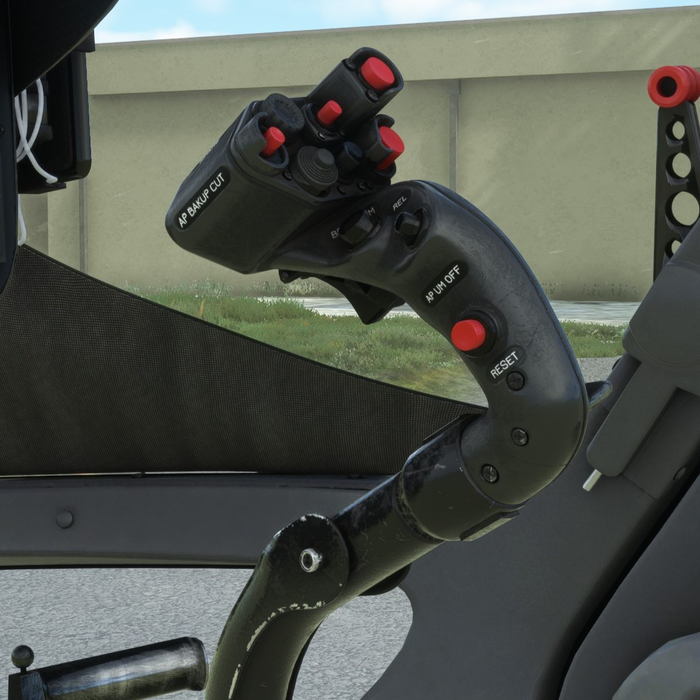
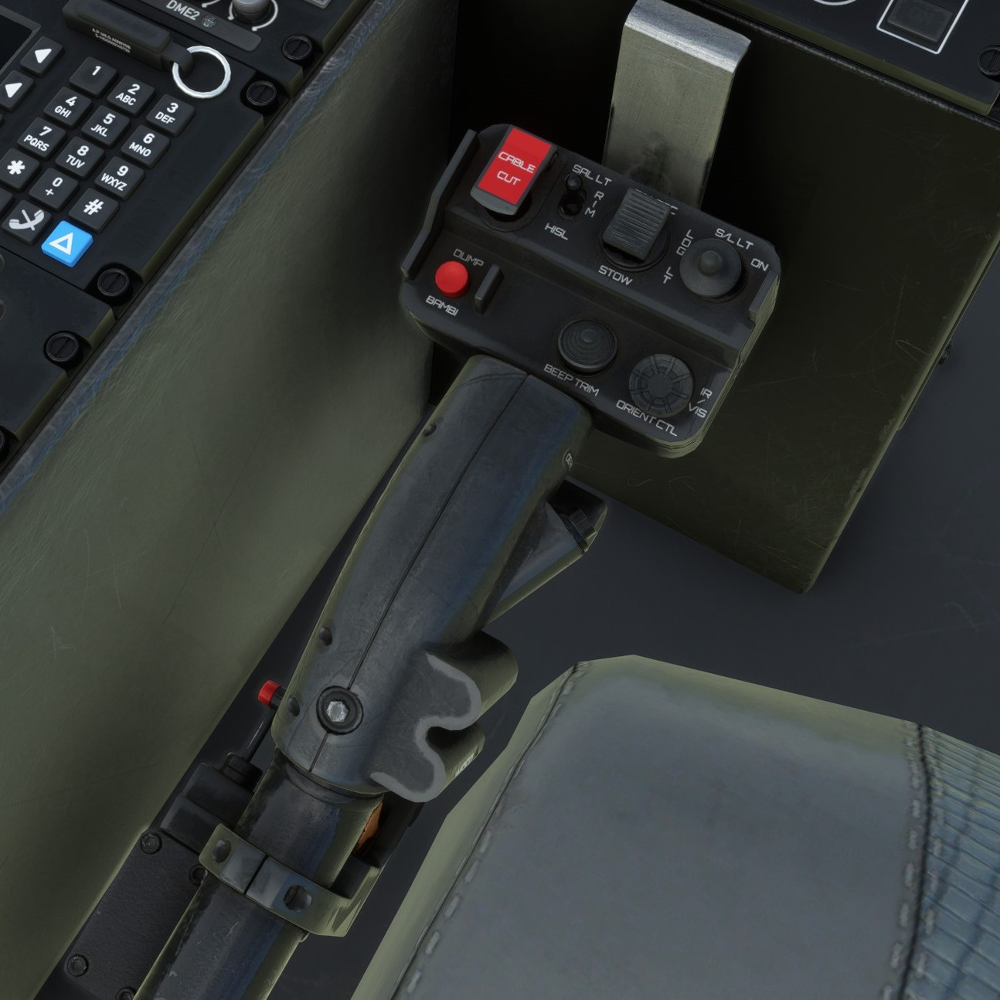
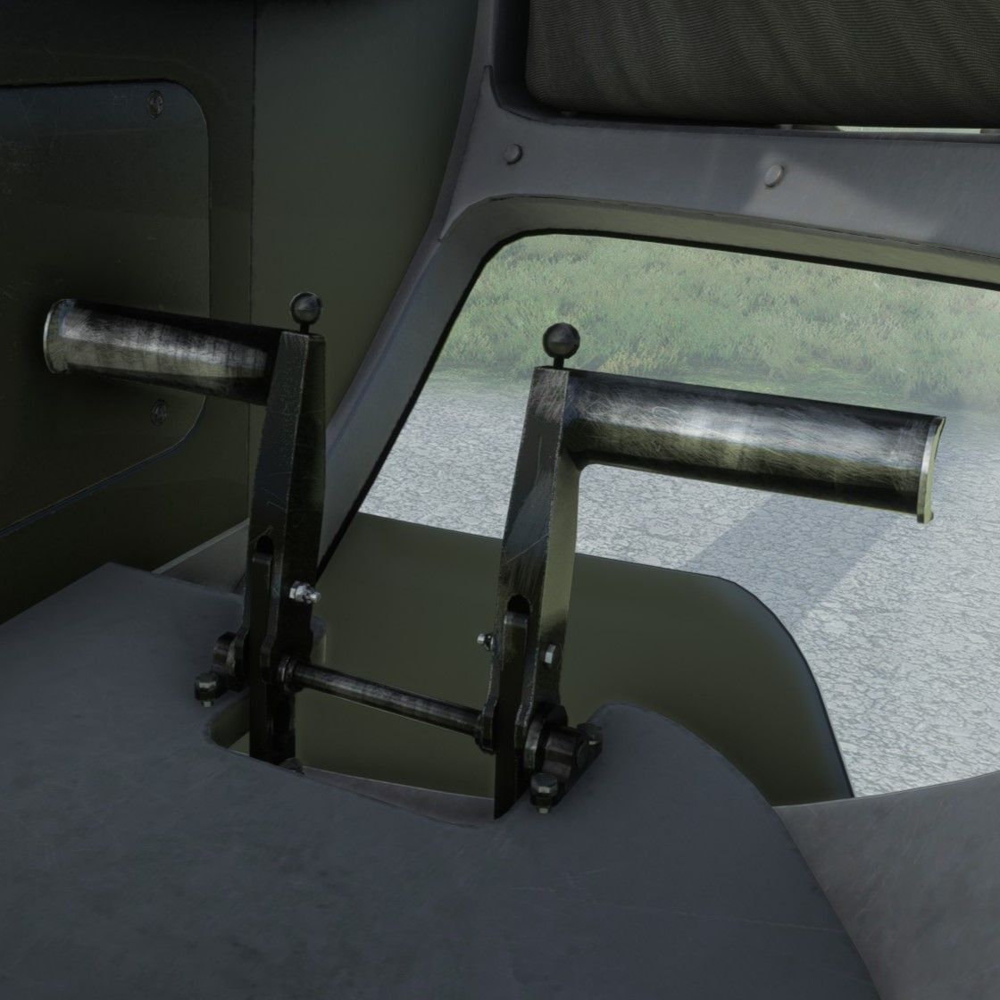
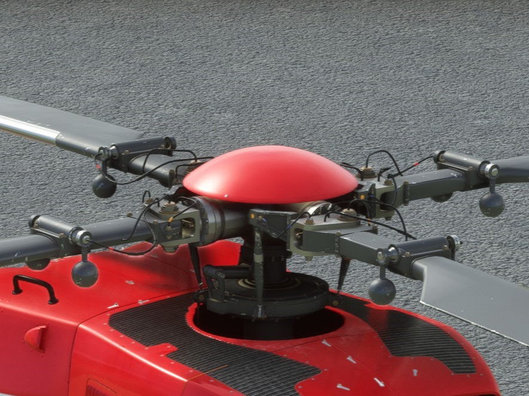

# Hubschrauber Steuerorgane

Die wichtigsten Steuerorgane eines Hubschraubers sind Cyclic, Collective und die Pedale. Wir erklären die Funktionsweisen hier stark vereinfacht und gegebenenfalls nicht zu einhundert Prozent mechanisch und physikalisch korrekt.

## Cyclic

Der **Cyclic** ist der sogenannte "Steuerknüppel", der in horizontaler Richtung bewegt wird um die Rotorblätter zyklisch (also abhängig von ihrer Position) zu bewegen. Er ist mit den Schwenklagern des Hauptrotors verbunden und steuert die horizontale Bewegung des Hubschraubers. Wenn der Pilot den Cyclic nach vorne drückt, neigen sich die Rotorblätter so, dass sich der Hubschrauber nach vorne neigt. Die Vorwärtsgeschwindigkeit erhöht sich. Wenn der Cyclic nach hinten gezogen wird, passiert genau das Gegenteil. Durch Bewegen des Cyclics nach links oder rechts wird der Hubschrauber in die entsprechende Richtung geneigt und kann seitwärts fliegen.

:::info
Durch das Phänomen der sogenannten **Kreiselpräzession** tritt der Effekt einer Drehmomentänderung immer 90° im Drehsinn versetzt auf. Soll der Hubschrauber also nach vorne gekippt werden, muss in Flugrichtung links ein höherer Auftrieb als rechts erzeugt werden, welcher den Hubschrauber eigentlich nach rechts kippen würde.(Vergleichbar mit dem Querruder bei klassischen Flugzeugen) Durch die Kreiselpräzession tritt der Effekt jedoch 90°versetzt auf - der Hubschrauber kippt nach vorne. Das ist natürlich abhängig von der Drehrichtung des Hauptrotors. Im Beispiel dreht dieser sich links herum.

Übrigens auch ein guter Test für Add-On-Entwickler und deren Verständnis von Physik.
:::

## Collective

Das **Collective** ist ein Hebel, der in vertikaler Richtung bewegt wird um die Rotorblätter kollektiv (also alle im selben Maße) zu bewegen. Es ist mit dem Hauptrotorblatt des Hubschraubers verbunden und kontrolliert die vertikale Bewegung des Hubschraubers. Wenn der Pilot das Collective erhöht _("daran zieht")_, erhöht sich der Anstellwinkel aller Rotorblätter und damit der Auftrieb, was den Hubschrauber in die Luft hebt. Wenn der Collective verringert _(nach unten gedrückt)_ wird, nimmt der Anstellwinkel aller Rotorblätter ab und der Hubschrauber verliert an Auftrieb, er sinkt.

## Pedale

Die **Pedale** steuern den Anstellwinkel der Heckrotorblätter und sorgt für ein Drehmomentausgleich. Ohne eine Art Heckrotor _(es gibt viele verschiedene Bauweisen und Funktionen, siehe NOTAR, oder doppelte Hauptrotoren)_ würde sich die Zelle des Hubschraubers entgegen der Drehrichtung des Hauptrotors drehen. Er wäre unkontrollierbar und würde abstürzen.

## Zusammenfassung

Die kombinierte Nutzung aller drei Steuerorgane lässt den Piloten den Hubschrauber erfolgreich steuern. Der Ausfall eines der Steuerorgane kann den Hubschrauber entweder unmanövrierbar machen und im schlimmsten Fall zum Absturz führen.

