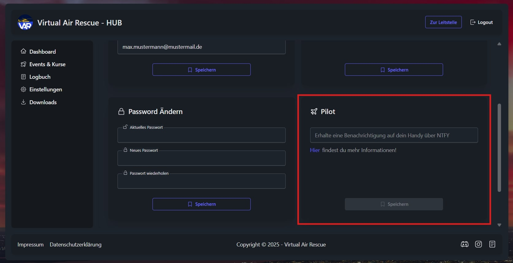
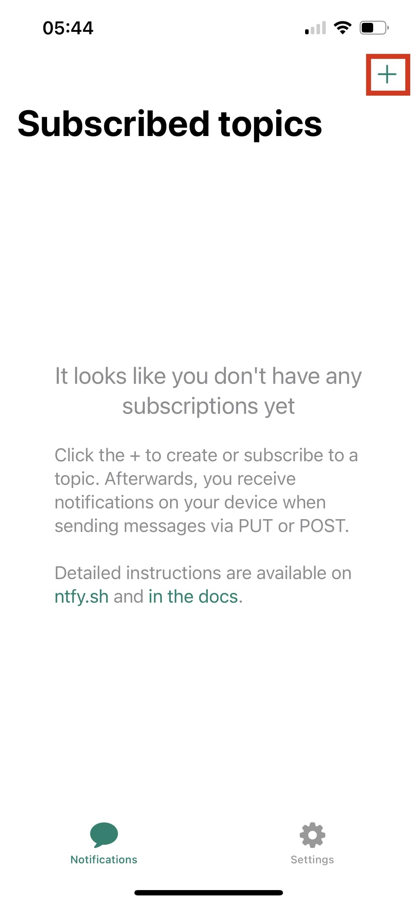
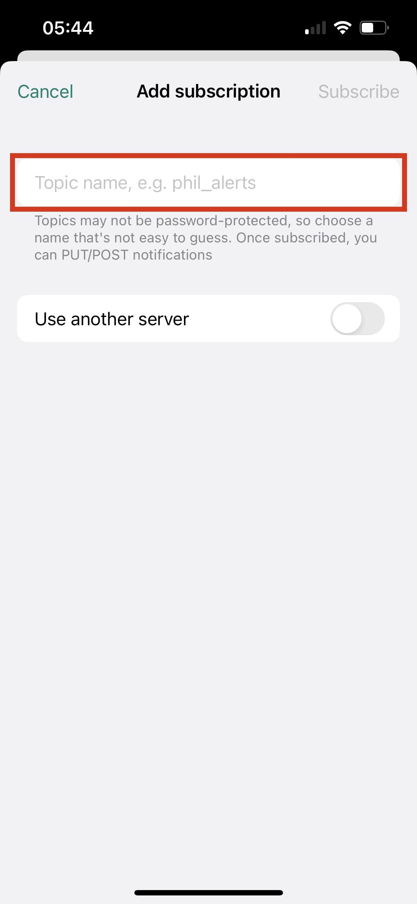
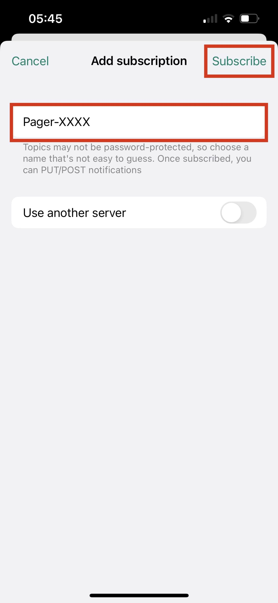
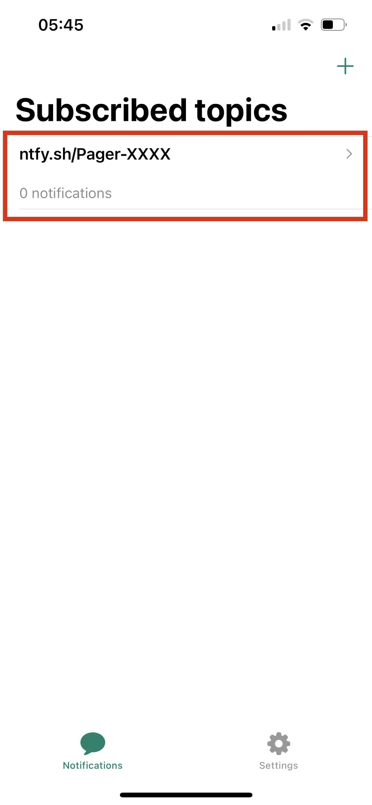
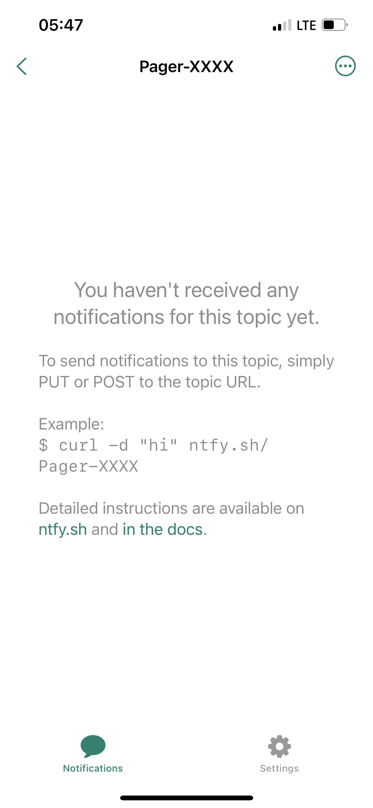

# App - Alarmierung

Mit der App Alarmierung mithilfe von NTFY ist es möglich, **aber nicht verpflichtend**, Alarmierungen auch auf dem Handy zu empfangen.

## Download

Die App NTFY ist für [Android](https://play.google.com/store/apps/details?id=io.heckel.ntfy&hl=de&pli=1) und [iOS](https://apps.apple.com/de/app/ntfy/id1625396347) erhältlich.
Die Entwickler des Systems haben im Falle tiegründiger Fragen ebenfalls eine [Dokumentation](https://docs.ntfy.sh/).

:::warning Achtung
Die VAR ist weder Urheber noch Entwickler der NTFY App. Wir erklären lediglich die Installation in Verbindung mit der Funktion unseres Leitstellensystems. Für die grundlegende Funktion der App NTFY bieten wir **keinen Support**. Supporttickets und Anfragen bezüglich der grundlegenden Funktionen der App, welche über die hier aufgeführten Erläuterungen hinausgehen, werden ignoriert und geschlossen.
:::

## Einrichtung im HUB

### Schritt 1

Gehe zu Einstellungen.

### Schritt 2

Trage hier den Namen deines mobilen Melders ein. Wir schlagen den Namen Pager-XXXX vor. Dabei stehen die X für die Ziffern der VAR Nummer.
Falls die VAR-Nummer unbekannt ist, kann sie auf der Startseite sehen (VARXXXX).

### Schritt 3

Klicke auf "Speichern"

## Einrichtung in der App

### Schritt 1

Klicke auf das "+" in der oberen rechten Ecke deines Displays.

### Schritt 2

Trage hier den zuvor festgelegten Namen für deinen mobilen Melder ein.

### Schritt 3

Tippe auf "Subscribe"

### Schritt 4

Mit einem Klick auf das hier umrandete Fenster kannst du später deine Alarmierungen sehen.

:::tip Tipp
Mit dem Button "quittieren", welcher **erst erscheint, wenn eine Alarmierung eingegangen ist**, kann der Alarmton des Melders in der Leitstelle stummgeschaltet werden.
