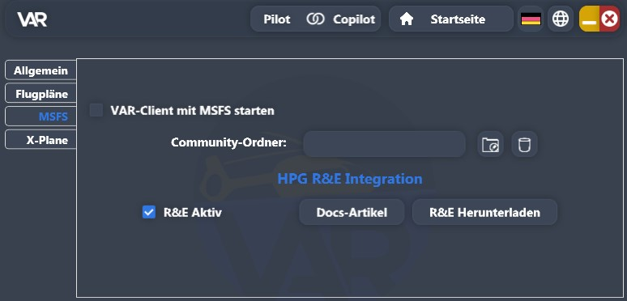
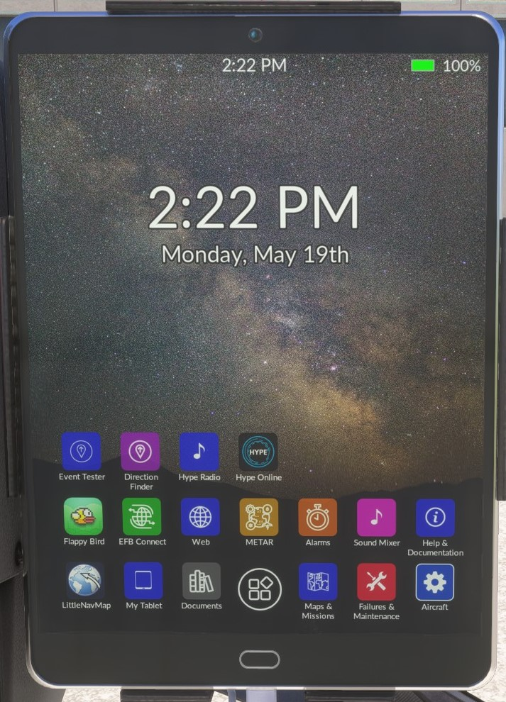
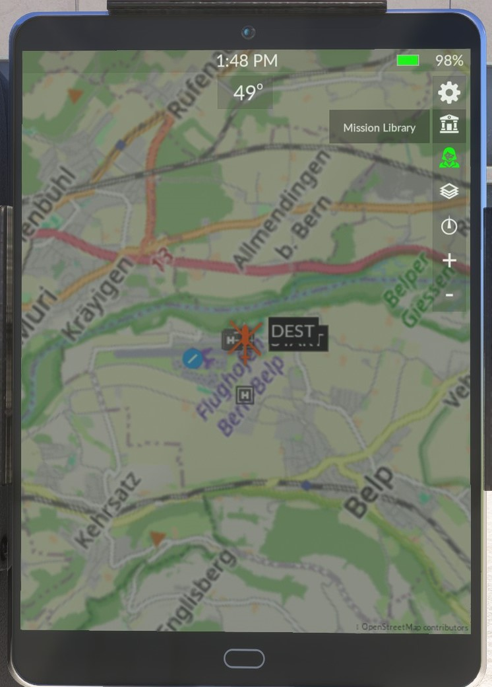
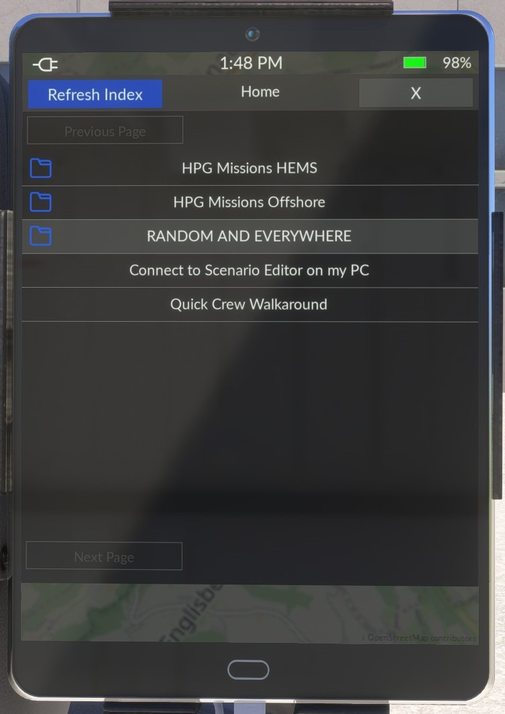
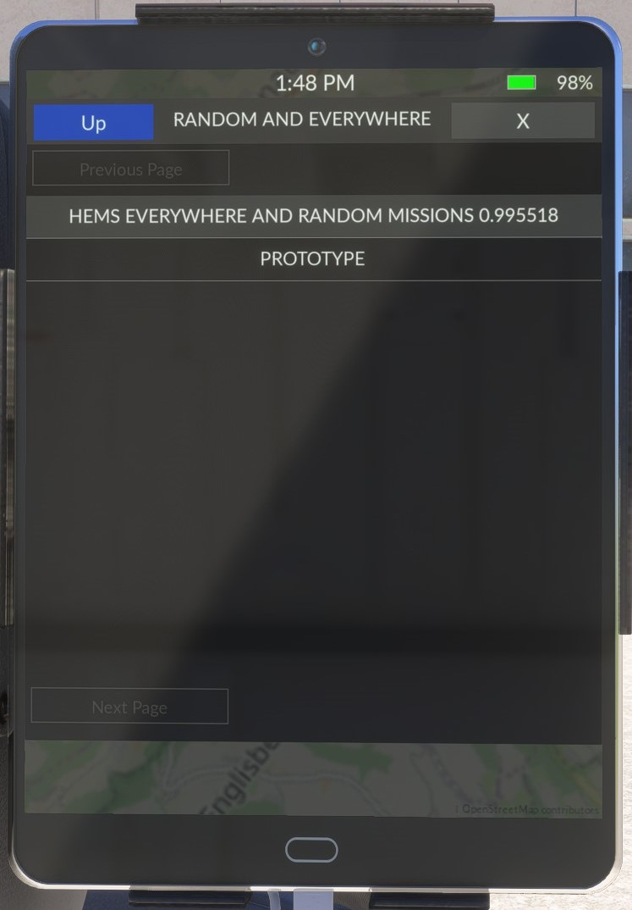
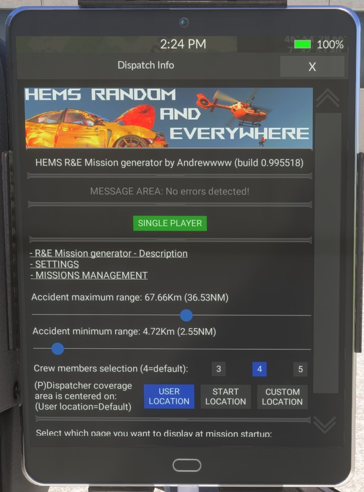
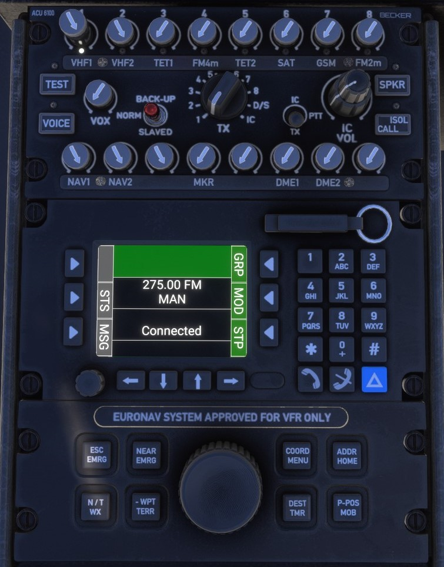
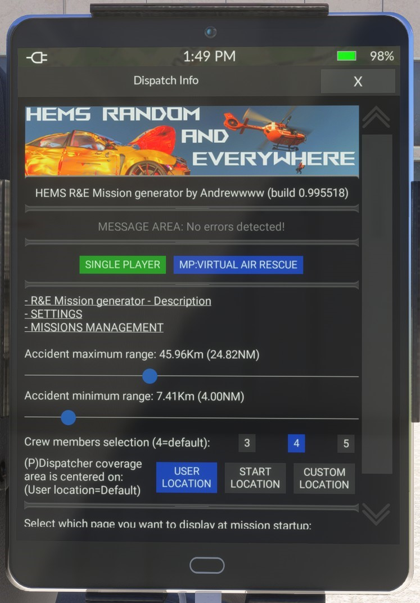
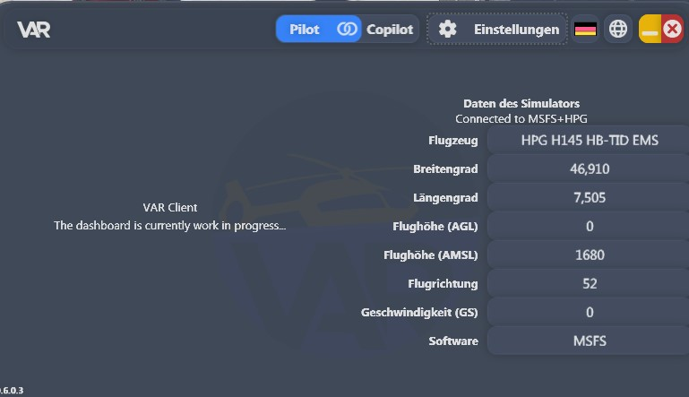

# Random & Everywhere Script Einrichtung

## VAR-Client

Um die Integration mit dem R&E Missionsskript zu aktivieren, musst du in den Einstellungen des VAR-Clients die Option
"Einstellungen > MSFS > HPG R&E Integration > R&E Aktiv"
aktivieren.

## Simulator

Wenn du bereits weißt, wie der lokale Modus des R&E Skripts funktioniert, kannst zu zum Punkt [Verbinden mit dem VAR-Client](#verbinden-mit-dem-var-client) springen

## Starten des R&E Skripts

Um das R&E Skript zu starten, wählst du auf dem Tablet rechts neben dem Dashboard zunächst den Punkt "Maps & Missions".

Als nächstes öffnest du über die Missionsbibliothek das R&E Skript und startest dieses.

|  |  |  |  |
| --------------------------------------------------- | --------------------------------------------------- | --------------------------------------------------- | --------------------------------------------------- |

Du solltest jetzt auf dem Startbildschirm des R&E Skripts sein

## Verbinden des CARLS-Funkgeräts

In der Mittelkonsole des Helikopters findest du das CARLS-Radio. Dieses muss eingeschaltet werden, damit eine Kommunikation mit der Leitstelle möglich ist.

Schalte das Gerät ein, indem du zuerst den runden Knauf drückst, um das Gerät zu starten und anschließend mit der Taste "Anrufen" eine Verbindung zur Leitstelle herstellst.

## Verbinden mit dem VAR-Client

Stelle nun eine Verbindung mit dem VAR-Client her, indem du auf die Schaltfläche "Pilot" bzw. "Copilot" klickst.

Sobald eine Verbindung zwischen dem VAR-Client und dem Simulator besteht, erscheint auf der Startseite des R&E Skripts die Schaltfläche "Multiplayer".
Klicke auf diese Schaltfläche, um die R&E Integration im Missionsskript zu aktivieren.

Nach kurzer Zeit wird auch im VAR-Client angezeigt, dass die Verbindung zu der HPG-Maschine hergestellt ist.

## Abschluss

Jetzt ist die R&E-Integration aktiv und du kannst dich mittels Status 2 einsatzbereit melden.

Seit der V2 ist es nun auch möglich, über das CARLS-Funkgerät den eigenen Status mit den Tasten an die Leitstelle zu übermitteln
