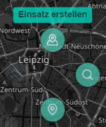
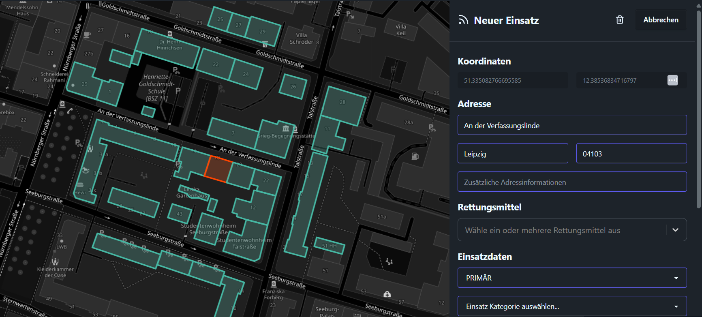
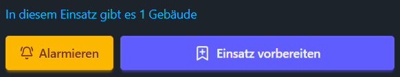
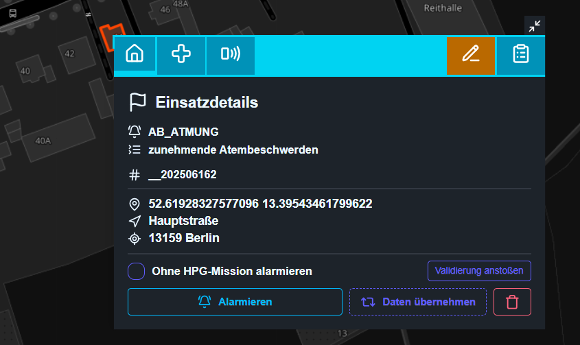
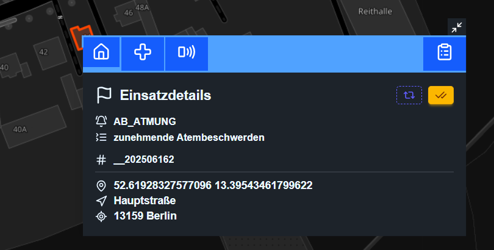
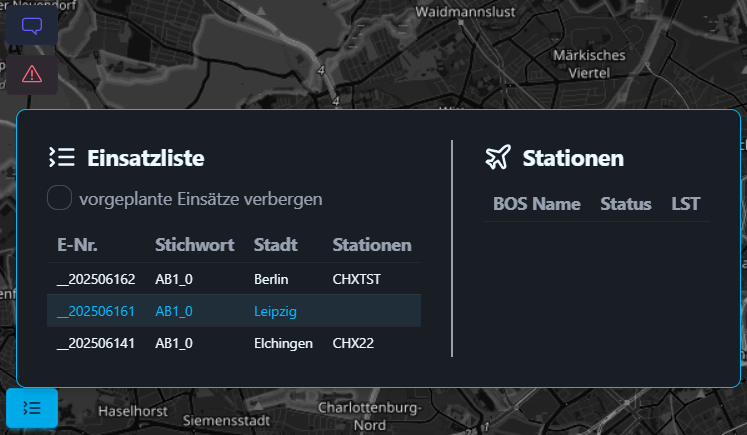
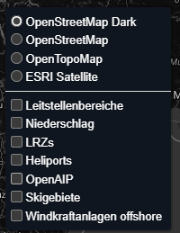

Auf dieser Seite beziehen wir uns auf die Funktionalität der [Webleitstelle](https://ops.virtualairrescue.com/dispatch) des Leitstellensystems.

Während du als Leitstelle aktiv bist, muss die Webleitstelle die immer geöffnet bleiben, da hierüber die gesamte Kommunikation und Koordination passiert. Weitere Informationen zum Disponenten-Interface findest du [hier](/var-systeme/webleitstelle).

## Einsatzalarmierung

Mit einem Rechtsklick auf die Karte kannst du an der jweiligen Position einen neuen Einsatz starten.

Die anderen Buttons sind zum Suchen Nach Gebäuden an der jeweiligen Position sowie um die Koordinaten in die Zwischenablage zu kopieren.

Jetzt wird der Ort auf der Karte zentriert, es werden einige Gebäude im näheren Umkreis markiert und auf der rechten Seite öffnet sich die Einsatzmaske. Die Maske wird wie gewohnt ausgefüllt.

Die hervorgehobenen Gebäude sind entweder Blau oder Orange markiert. Orange Gebäude sind die für den Einsatz ausgewählten Gebäude. Durch anklicken eines blauen Gebäudes wird dieses zum Einsatz hinzugefügt und vice versa.

Durch Rechtsklick -> Lupe wird die Gebäudemarkierung zurückgesetzt und an der neuen Position neu gestartet.

Der Einsatz kann nun direkt alarmiert werden oder nur vorbereitet abgespeichert werden.

Wir haben diesen Einsatz aus Demonstrationszwecken vorerst nur vorbereitet.
Vorbereitete Einsätze erscheinen in Hellblau und können nur von angemeldeten Disponenten gesehen werden, aktive Einsätze erscheinen in Dunkelblau für alle sichtbar.

Auf der Startseite sehen wir kurze Infos zu Adresse und Stichwort sowie die Möglichkeit den Einsatz zu Alarmieren oder zu löschen.

Der zweite Tab zeigt Patienten sowie Einsatzinformationen, der dritte bietet eine Schnittstelle zum Nachalarmieren.

Der Orangene Stift bietet die Möglichkeit, den Einsatz noch zu bearbeiten, diese Option ist nur für vorbereitete Einsätze verfügbar.

Im letzten Tab haben wir einen Einsatzlog mit Zeitstempeln der Statusmeldungen sowie Notizen von Disponeten zu einem Einsatz zeigt.

Über das kleine Icon oben rechts lässt sich das Einsatz Popup wieder schließen.

## Nach der Alarmierung

Nun sind die Alarmierungsoptionen verschwunden, stattdessen können wir mit den 2 Buttons oben rechts entweder den Einsatz "kopieren" und daraus einen neuen Erstellen oder ihn abschließen.

Auf der Seite der Nachalarmierung gibt es nun einen Button an der gleichen Position um die Alarmierung erneut zu schicken.

## Sonstiges

Am linken Seitenrand gibt es einen Chat, die Möglichkeit jemanden zu reporten sowie eine Liste aller Einsätze und aktiver Stationen.

In der unteren rechten Ecke findest du eine Übersicht über die verfügbaren Kartenlayer.

Die oberen 4 kreisförmigen Auswahlelemente bestimmen die **Basiskarte**. Von diesen kann immer nur eine zur gleichen Zeit gewählt werden.
Die unteren Checkboxen ermöglichen das Überlagern von zusätzlichen Informationsebenen über die Basiskarten.
- **Leitstellenbereiche** zeigt die Funkverkehrsvereiche der unterschiedlichen Leitstellen an.
- **Niederschlag** zeigt Informationen von Niederschlagsradaren.
- **LRZs** zeigt alle verfügbaren Lufrettungszentren mit Zusatzinfomrationen per Hover und Klick. So werden per Klick etwa die 10- und 20-Minuten Isochronen eingeblendet.
- **Heliports** zeigt die meisten Landeplätze mit ihren Designatoren.
- **OpenAIP** zeigt Lufträume
- **Skigebiete** zeigt Skigebiete mit Pisteninformationen und Wintersportstätten
- **Windkraftanlagen offshore** zeigt Windparks in der Ost- und Nordsee